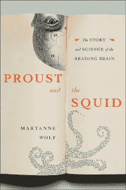

<!--yml
category: 未分类
date: 2024-05-12 21:10:02
-->

# Falkenblog: Socrates's Lament

> 来源：[http://falkenblog.blogspot.com/2011/01/socratess-lament.html#0001-01-01](http://falkenblog.blogspot.com/2011/01/socratess-lament.html#0001-01-01)

Nicholas Carr wrote

[The Shallows: What the Internet Is Doing to Our Brains](http://www.nytimes.com/2010/06/06/books/review/Lehrer-t.html?ref=review)

, which talks about how the internet is turning our minds into mush. It is too easy to seem to understand what you are talking about, to get distracted, etc.

This seems to be a constant refrain, and I'm sure it came up when calculators were invented. But I was surprised that Socrates came up with it first. In Maryann Wolfe's book

[Proust and the Squid](http://calitreview.com/261)

, she notes the Greek alphabet was a real innovation in human culture. An alphabet uses the minimum of notations necessary to express a spoken language unambiguously to its native speakers. It has a mere 26ish letters, as opposed to 900 cuneiform characters in Sumerian, and thousands of hieroplyphs in Egyptian.

Yet Socrates complained that with written texts, it would be less necessary to memorize passages, because you could always just pick up a tablet when needed. When you actually have to memorize the Iliad you understood it better than if you relied on cheat sheets. He thought easy information acquisition lead to an illusion of knowledge, and thus curtailed the more difficult, critical thought processes that lead to knowledge. The semblance of knowledge is easier, and can lead to a lack of knowledge if someone stops as soon as they merely appear knowledgable by using their new fangled written text.

I must say there's some truth here, which is why it keeps recurring. Surely if you memorized the Iliad you understood it moderately well. Similarly, if you have only used statistical software with prepacked routines, rather than coding it up yourself, you probably do not understand it as well as you could. Yet, once you

do

understand it, having the prepackaged routines makes you a lot more efficient, as anyone who uses Excel can understand. The key is to spend time really learning tools that give you a competitive edge. Ultimately, anything really important you bring to the table takes some barriers to entry, which involves the time needed to develop the technique or wisdom of some special insight you have. You have to simply not fool yourself when you use things you do not really understand; it takes simple discipline.

Plus, there's the matter of memory limits. Our brain is finite. Wolf's a specialist on language processing, and seems especially motivated by the dyslexia in her family. These are people otherwise normal who have difficulty reading. On problem with dyslexics are the visual reversals, as when "b" is confused with "d" or "p" with "q", Dysexic children can write these different letters correctly, but will often say the wrong names. They have trouble associating the letter to a phoneme, and this hinders their understanding of the writing because phonemes are intrinsic to how we actually process language (explains why I often misspell homonyms).

Wolf notes that dyslexics tend to use more of their right hemisphere processing speech than regular readers. However, she argues this frees up the left hemisphere for other tasks, and so many dyslexics are phenomenally productive using this extra space for visual-spacial competence. She argues that these deficits are directly related to excellence in the examples of Leonardo Da Vinci, Einstein, and Thomas Edison.

This is an interesting hypothesis, that 'freed space' makes one better at something. It reminds me of that scene in Sherlock Holmes'

[Study in Scarlet](http://en.wikiquote.org/wiki/Sherlock_Holmes)

, where Watson was amazed that Holmes was ignorant of famous writers like Thomas Carlyle, and did not understand Copernican Theory of the solar system. Holmes interjected:

> I consider that a man's brain originally is like a little empty attic, and you have to stock it with such furniture as you choose. A fool takes in all the lumber of every sort that he comes across, so that the knowledge which might be useful to him gets crowded out, or at best is jumbled up with a lot of other things, so that he has a difficulty in laying his hands upon it.

The brain can hold a lot of concepts, but not an infinite number. The idea that the size of my brain is a constraint is interesting, and there is rather strong evidence of a

[positive correlation between brain size and IQ](http://www.iq-tests.eu/iq-test-Brain-size-and-IQ-510.html)

(>0.4). As a materialist, this should come as no surprise.

If you have good discipline, access to easy information is a good thing. It's may be easier to cheat and appear knowledgeable now more than ever, and if that's your goal, you live in good times, but it's as hard as ever to find something new, true and important. You simply can't afford to not use the short-cuts offered by prepackaged software and internet searches that enable one to kludge together data and ideas that make us productive relative to others.