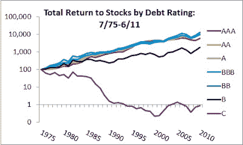

<!--yml
category: 未分类
date: 2024-05-12 20:45:55
-->

# Falkenblog: Stock Returns by Debt Rating

> 来源：[http://falkenblog.blogspot.com/2011/09/stock-returns-by-debt-rating.html#0001-01-01](http://falkenblog.blogspot.com/2011/09/stock-returns-by-debt-rating.html#0001-01-01)

Above are annual returns for portfolios formed every July 1, based on the Senior rating of the company. I only used non-financial companies because financial companies tend to be only with investment grade, and they are very different from a debt rating perspective (when I modeled default at Moody's, there was a clear non-financial focus because financial companies are very different).

The annual data are as follows for this period (Jul1975-Jun2011):

|  | StockReturns(%) | beta | Volatility(%) |
| AAA | 12.4 | 0.78 | 17.1 |
| AA | 13.9 | 0.81 | 16.1 |
| A | 14.3 | 0.81 | 16.5 |
| BBB | 14.2 | 0.82 | 17.9 |
| BB | 15.0 | 1.04 | 23.4 |
| B | 8.6 | 1.43 | 32.0 |
| C | -12.7 | 1.18 | 44.9 |

It appears there's a reasonable story one could tell about returns from AAA to BB: higher returns, and higher intuitive measures of risk: beta, volatility. But for B and C rated stocks, the returns make no sense to standard asset pricing theory, because these are obviously risky stocks. I remember presenting this chart to an NBER conference around 2000, and the esteemed audience told me I was wrong; my data had to be incorrect. I was working at Moody's, so my ratings data was as good as it got. Anyway, I wrote it up and sent it to Journal of Portfolio Management, and the editor, Peter Bernstein, wrote back they weren't accepting submissions at that time. I thought that was an odd response. This avenue wasn't part of my day job, so I let it go, but I keep updating my data for fun.

The result is really corroborated by

[Campbell, Hilscher and Szilagyi (2005)](http://www.efalken.com/pdfs/CampbellHilscherSzilagy.pdf)

, who found distress risk to be negatively correlated with stock returns, which makes sense because volatility and leverage is inversely correlated with future returns, and cash-flow is positively correlated with future returns, so those are the main drivers of default risk.

Reality is that which, when you don't believe it, doesn't go away, so I don't really mind when people tell me I'm wrong on facts like this.