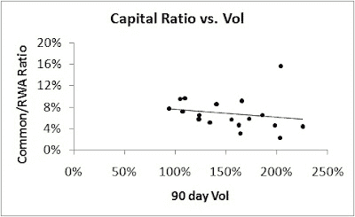

<!--yml
category: 未分类
date: 2024-05-12 22:04:28
-->

# Falkenblog: Stress Tests Not Absurd, Just Irrelevant

> 来源：[http://falkenblog.blogspot.com/2009/05/stress-tests-not-absurd-just-irrelevant.html#0001-01-01](http://falkenblog.blogspot.com/2009/05/stress-tests-not-absurd-just-irrelevant.html#0001-01-01)

Well, the Treasury announced their stress test results, and the adverse events they are guarding against aren't absurd. For example, average credit card charge-offs are 5% a year. The baseline case is 6-8%, and the adverse 9-10%. Consumer loans don't move as much in bad times, and I haven't heard of aggregate credit card charge offs that high, but if the Roubini scenario arises, I guess it's possible. C&I loans they think might rise to 4% (annualized), which is a reasonable worst case scenario. And so on down the line.

[Simon Johnson](http://baselinescenario.com/)

(who was interviewed today by 5 different national news outlets for the same money quotes) and other doomsters think this is all capture by the banks, that we should nationalize asap and put someone more public minded on their boards, like Franklin Raines or Jamie Gorelick. Looking to the ex-Chief Economist at the IMF for advice on financial markets is like asking Ronald McDonald for advice on a good menu--the guy was a PR prop. The IMF are a bunch of top-down do-gooders with a horrible track record. His current credibility comes from first his position at MIT, and then journalists thinking that businessmen actually listen to the chief economists of aid groups like the IMF. I hope they realize that the FCC and other regulator bodies that cover journalists have economists. I'm sure they have no clue, or care, what these people think.

But what is the relationship between capital and risk? It makes sense if you assume that capital is a cushion for losses on a static portfolio. But banks do not have static portfolios, they have franchises, with a lot of turnover and brandvalue. A bad analogy is at the bottom of all bad ideas, and the bad analogy here is that a bank is closed-end portfolio of rated securities. It's a franchise, with brand value, and most of its present value is from assets currently not on the books.

Look at the relationship between equity volatility and the capital to risk-weight asset ratio above for the banks under review. There should be a negative relatioship between the cushion (capital/risk weighted assets), and volatility. There is, but the R2 is 0.06, meaning, the relationship is insignificant (note: using implied volatilities gives the same result). So, the market does not see a strong correlation between capital-to-assets and risk, but for the Treasury, that is all that matters. This highlights that what is measured (capital to assets) is what is managed by super senior management, no matter how irrelevant.

Note the key to this crisis was the erosion of mortgage underwriting standards that occurred prior to 2008\. Did regulators ever mention this, except when encouraging them? Thus, like macroeconomics, the keys are incentives that are decentralized and parochial to a small niche (big banks have literally hundreds of different businesses with different underwriting criteria and expected losses), but top-down diktats can only address big things like 'total capital to assets', and so the focus. This highlights the random nature of Federal regulation.

This seems insanely misguided, top-down, attempt to do something. Note that the capital add is much more correlated with the current estimated earnings per share over price:

So, the capital add is consisttent with current estimates of

this quarter's losses

, more than anything else, which I guess makes it less hurtful (correlation go down significantly for subsequent periods).

I would prefer that they merely apply this exercise, disclose the results, and let the market render their verdict. Everything gets complicated when government has to micromanage something they are dilettantes in. It would be nice if banks had to disclose greater particularity about the nature of their assets and liabilities. Regulations can be good, and made better. But this exercise is like the

[Homeland Security Advisory System](http://www.dhs.gov/xinfoshare/programs/Copy_of_press_release_0046.shtm)

, the appearance of doing something useful, thinking that 90% of risk management is in appearances.