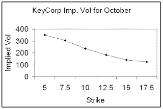

<!--yml
category: 未分类
date: 2024-05-12 22:54:56
-->

# Falkenblog: Surprises are Over Anticipated

> 来源：[http://falkenblog.blogspot.com/2008/10/surprises-are-over-anticipated.html#0001-01-01](http://falkenblog.blogspot.com/2008/10/surprises-are-over-anticipated.html#0001-01-01)

Now, as almost everyone seems to have called the housing crisis in advance, but totally caught Wall Street flatfooted, there's a lot of tut-tut-ing about how they should have known that unexpected things can happen. In the latest,

[Yves Smith](http://bloggingheads.tv/diavlogs/14850)

notes that Benoit Mandelbrot noted that securities have fat tails, and 'should have known' better that these things happen.

Well, I agree that Wall Street made a mistake. But the fact that all the big Wall Street firms made the same mistake suggests that it was not obvious--these people may be rich and morally inferior to pundits, but that does not make them stupid. On the outside, I'm not sure how anyone was to know these firms all were making this trade, and I hope transparency aimed at that end is part of any new regulation. But "not expecting the unexpected", if not a tautology, means in practice we under appreciate tail events.

Looking at implied options for KeyCorp, we see implieds going up from around 200 at the money, to 350 for out-of-the-money puts, which indicates a massive amount of market expectations of a large jump to zero. Methinks that the market if anything is too enamored with tail events.

The problem is not that people don't understand the concept of fat tails or asymmetric distributions, in general. The essence of systematic risks is more nuanced than that.