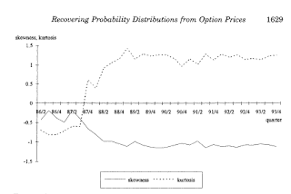

<!--yml
category: 未分类
date: 2024-05-12 21:54:53
-->

# Falkenblog: Tail Volatility and 1987

> 来源：[http://falkenblog.blogspot.com/2009/07/tail-volatility-and-1987.html#0001-01-01](http://falkenblog.blogspot.com/2009/07/tail-volatility-and-1987.html#0001-01-01)

There was an interesting paper on estimating the probability of the tails via option prices (see Backus, Chernov, and Martin

[here](http://pages.stern.nyu.edu/~dbackus/GE_asset_pricing/disasters/BCM_disasters_latest.pdf)

).

[Barro](http://www.nber.org/papers/w13940)

seems to have really revived the Rietz 'peso problem' model, by looking at a variety of large macro-economic shocks related to wars and revolutions in the twentieth century. There's an excellent summary of this work

[here](http://neweconomist.blogs.com/new_economist/2005/09/new_research_on.html)

.

One person noted that things could actually be pretty boring. That is, in 1987 the market fell so much on one day (23%), ever since then there has been a large premium for out-of-the-money options. The graph above is from

[Jackworth and Rubinstein (1994)](http://papers.ssrn.com/sol3/papers.cfm?abstract_id=7849)

. This shows that basically the market did not anticipate the 1987 crash, but since then, has this event priced in.

The funny thing is how far back and how deep this literature on disasters is. Nassim Taleb and his acolytes (the Taleban) seem to think economists are totally wedded to the Gaussian distribution, which ignores fat tails and extreme events. That is, he sees the naive Black-Scholes model, and ignoring the volatility smile, infers that this means economists don't believe disasters matter. This is just a really ignorant and misleading statement, fun for dilettantes who love to lampoon experts via a caricature, but it is really a waste of time.