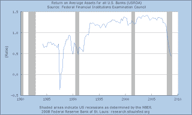

<!--yml
category: 未分类
date: 2024-05-12 22:35:38
-->

# Falkenblog: The Case for Financial Stocks

> 来源：[http://falkenblog.blogspot.com/2009/01/case-for-financial-stocks.html#0001-01-01](http://falkenblog.blogspot.com/2009/01/case-for-financial-stocks.html#0001-01-01)

Financial companies are toxic waste currently, because they are at the center of the recent meltdown. They are not merely symptoms of the excessively foolish subprime crisis, but were active participants, a stunning combination of negligence, stupidity, and greed.

Taleb has

[stated](http://www.edge.org/3rd_culture/taleb08/taleb08_index.html)

that banks have lost more money than they have made in their history, a statement that was 'too good to check' I guess. I'm betting this error is a combination of off-the-cuff loss estimates--eg, 1 Trillion USD, which was global not US--and using nominal dollars. Using Ken French's

[website](http://mba.tuck.dartmouth.edu/pages/faculty/ken.french/data_library.html)

, out of 44 stock industries with data back to 1926, financials had the 9th highest return since then, Banks 5th. An investor forced to choose sectors in 1926 would have done much better in financials or banks than the average equity investment.

A common bank profitability metric is Return on Assets (ROA). On average, a bank makes 1% on assets, historically. Now, if you look at the entire financial sector, (say using S&P/MSCI Barra's GICS from 5000-5280), you see the average NetIncome/Assets of 0.78% since 1989, including the most recent year. The graph shows the ROA for all US banks since 1984 as

[estimated by the St.Louis Fed](http://research.stlouisfed.org/fred2/series/USROA?cid=93)

, and this independently corroborates this mean result. That is, aggregate earnings in the financial sector included a lot of large write-offs, but the net for the year 2008 was near zero earnings, not something that returned total earnings for the sector to zero from the beginning of recorded history.

Currently, bank stocks have a forward P/E of around 13, meaning, using the current price, and the estimates for earnings next year, the ratio is 13\. But this average ignores the fact that the largest stocks have the lowest P/Es: KeyCorp, National City, Citigroup, Wachovia, Comerica. If

all

the banks had a forward earnings equal to 0.78% of assets (its historical average over the past 20 years), and the P/E were then equal to the median P/E, the bank sector's market cap as a whole would rise 150%. That is, if all banks earned 0.78% of assets going forward, and if they all had P/Es of 13, the total sector market cap would be $519B for the top 50 US banks, not $204B. This is an example of what Warren Buffet calls a 'low risk' idea, because the expected return is so great, you have to have a lot of wrong assumptions to underperform a benchmark of say, 12% annual return.

Now, on the other side, are people like Paul Krugman,

[saying](http://www.nytimes.com/2009/01/19/opinion/19krugman.html)

that many of these banks are technically insolvent because their assets are market too high (his example is Citigroup). I think these banks have been written down aggressively in part because the new regimes want to have a new base to benchmark against, and the failures of the past are already the fault of prior regimes (they wish to assert, anyway). So, if you are a new CEO of a troubled company, or just acquired a troubled company and have access to the US Federal Government's $700 TARP funds, you want to write down as much as possible. I don't think they are holding back, but I can see how smart people, at 30,000 feet, think this is all so obvious.

Historically, stock market losing sectors show a strong rebound after falling greater than 50%, as financials have recently done. Not that they make it all back, hardly, but they have good returns their first year out of the crisis nonetheless. Biotech in 1992, Oil in 1980, the Nifty 50 in 1972, Japan in 1990, Tech in 2002\. Things don't go down forever. Of course, the future may not be like the past, but I think it is our best guess going forward. The financial decline has been going on since May of 2007, and I think the worst-case-scenario is already baked into financial market prices.