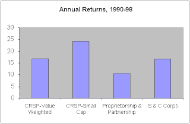

<!--yml
category: 未分类
date: 2024-05-12 23:12:04
-->

# Falkenblog: The Curious Case of Entrepreneurial Returns

> 来源：[http://falkenblog.blogspot.com/2008/06/curious-case-of-entrepreneurial-returns.html#0001-01-01](http://falkenblog.blogspot.com/2008/06/curious-case-of-entrepreneurial-returns.html#0001-01-01)

Entrepreneurial investment, such as in small proprietorships (S-corps and private LLCs) is generally a highly undiversified investment for most entrepreneurs. The reasons are straightforward, in that when one person has a significant effect on the business through his effort and competence, it is natural that he should have the most ‘skin in the game’. This is a classic issue of moral hazard because a business manager, who has significant upside and, without ownership, no downside, is motivated to take wild risks on the theory of heads I win, tails the banker loses. However, if the manager is the majority owner, his failure should affect his net wealth too. About 75 percent of all private equity is owned by households for whom it constitutes at least half of their total net worth. Indeed, households with entrepreneurial equity invest on average more than 70 percent of their private holdings in a single private company in which they have an active management interest.

Despite this dramatic lack of diversification, private equity returns are on average no higher than the market return on all publicly traded equity. The chart above, from

[Moskowitz and Vissing-Jorgensen](http://www.kellogg.northwestern.edu/faculty/vissing/htm/tmav_aer.pdf)

(AER 2002) shows the basic results, that over an 8 year period, if anything returns to private business, be it partnerships, proprietorships, S corps, C corps, and two entirely different sets of data, there is no demonstrable premium. Given an investor can invest in a diversified, and liquid equity portfolio, it is puzzling why households willingly invest substantial amounts in an asset with an equivalent return, but much higher volatility, including a positive correlation with the market.