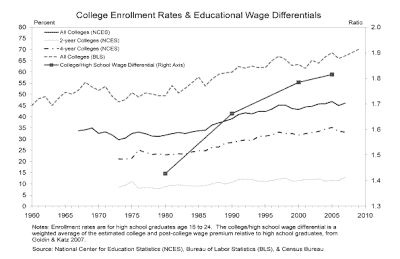

<!--yml
category: 未分类
date: 2024-05-12 21:12:00
-->

# Falkenblog: The Education 'Risk' Premium

> 来源：[http://falkenblog.blogspot.com/2011/01/education-risk-premium_03.html#0001-01-01](http://falkenblog.blogspot.com/2011/01/education-risk-premium_03.html#0001-01-01)

A big puzzle in education is that there appears to be a huge wage premium to college--about 80%--and yet only 40% of high school graduates go to college. Above is a graph from a

[paper by Athreya and Eberly](http://www.aeaweb.org/aea/2011conference/program/preliminary.php)

to be presented at this weekend's AEA meetings on the subject 'Risk and Expectations in Higher Education' [click to enlarge].

Looking at various types of post-secondary education and completion rates, there is a perverse lack of response to this carrot, typically described as strangely “anemic” (see

[Altonji, Bharadwaj, and Lange (2008)](http://www.voxeu.org/index.php?q=node/1110)

).

There are several ways to interpret this, such as constraints to kids going to college who can and want to, constraints facing households considering investments in human capital, or that this reflects compensation for, and responses to, an investment opportunity that is lumpy, irreversible, and most crucially, risky. That is, it's a risk premium. [The simple idea that this is from increased globalization and migration making unskilled labor worth less is not a prominent explanation, probably because academics like to assume that in aggregate skill is a function of education, a simple choice variable].

The risk premium story works like this: the average college-drop-out rate is 50%. Taking into account dropout risk, a simple calculation of risk premium accounts for about half of the excess return to college education. Thus,

[Gonzalo Castex](http://www.aeaweb.org/aea/2011conference/program/retrieve.php?pdfid=135)

proposes that the risk-premium of college participation accounts for about 29% of the excess returns to college education. Risk averse agents are willing to forgo the higher return to college in order to avoid the dropout risk.

Ah, the omnipresent risk premium. In theory, it explains so much of the variation in wealth and income around us. But when you examine it further, it simply acts like another free parameter that 'explains' the data via the magic of overfitting. Note that schools with the lowest completion rates are

[generally lousy schools](http://www.washingtonmonthly.com/college_guide/rankings_2010/dropout_factories.php)

like Southern University at New Orleans (5% graduation rate!). These schools don't generate a big wage premium, though their risk is huge. Or, if you look across majors, and account for the fact that more people 'switch' from hard majors like engineering to easy majors like sociology rather than vice versa, this drop-out risk also fails to explain the differential major wage premia. Lastly, there's PhD programs, where people seem to spend a lot of time for virtually no measurable increase in earnings compared to getting a Master's degree (see Economist article

[here](http://www.economist.com/node/17723223)

).

A good theory doesn't have to be be consistent with all the data, but it does have to explain at least 'most' of the conspicous data points it was not designed to explain. In this case, adding a risk premium can explain the 'puzzling' college wage premium, but does not generalize across colleges, within colleges, or across degrees (BA, MA, PhD). The 'risk premium' explanation is

always

a red herring.