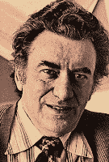

<!--yml
category: 未分类
date: 2024-05-12 22:00:51
-->

# Falkenblog: The Essence of Minsky

> 来源：[http://falkenblog.blogspot.com/2009/05/essence-of-minsky.html#0001-01-01](http://falkenblog.blogspot.com/2009/05/essence-of-minsky.html#0001-01-01)

Several bloggers have posted on Hyman Minsky, who is somewhat of a celebrity now that a crisis happened, and he wrote about financial crises. I was a teaching assistant for Minsky in college, back in 1986 at Washington University in St.Louis. I probably would not have gotten an econ PhD without his motivation, I really admired his intellectual enthusiasm, that he was attacking problems of importance and getting a lot of meaning out of it. The essence of his theory is that markets are endogenously unstable, and so, left to their own devices they repeatedly crash and burn. That, I think is true. But his mechanism was rather vague. He posited you have normal (hedge) finance, where investment is inspired by cashflow returns, which pays back both principle and interest. In hedge speculative finance, returns merely cover the interest. Finally, returns do not cover interest or principle, and you are hoping for your collateral to rise in value, which can happen in a bubble.

Unfortunately, this theory is pretty useless in real time. If you look at leverage ratios over the business cycle, they don't vary too much, so empirically you can't look at leverage and see any pattern. Like now, it is all ex post, in that very few people were warning of a housing bubble pre-2007\. After the fact it is obvious, but theory should be predictive. By definition, an asset collapse will be found to have been dependent on expectations of rising collateral prices, because if cash flow could prevent the crash there would not be one. On the other hand, some lenders knew their underwriting standards were predicated on collateral at least not falling in value, and this should have been a warning.

His post-Keynesian focus on the distinction between risk and uncertainty does not generate much insight, though I spent a lot of time on this because it is so very seductive. Though many have been intrigued by the Keynesian/Knightian uncertainty approach, in general uncertainty is positive correlated with volatility, and it does not generate a consistent return premium as one would expect. Analyst disagreement, trading volume, are correlated with volatility, and generally negatively related to cross sectional returns. IPOs have a lot of uncertainty--they have no track record--but they have lower than average returns. So I don't think this distinction buys one much, as risk and uncertainty are highly correlated, and so we have the same puzzles.

He had lots of wacky liberal ideas about economics. He thought monetarists were ideologues, that microeconomics was all apologetics (hated the 1st and 2nd welfare theorems), and that national income accounting implied deficits put a floor on profits (profits=investment+budget deficit). I remember once Rik Hafer was presenting some results on how rational expectations proved the Quantity Theory, noting that when money supply numbers were released, interest rates moved in the right way within minutes (in the eighties, money supply numbers moved markets--good times, good times). Minsky was reading the paper and said "you are doing all this over a 5 basis point move in interest rates! This is irrelevant!" And stormed out. Everyone kind of looked at each other like "there he goes again".

I remember a couple times when he heard the market was down a lot, he would get all excited. This is it! He was always waiting for the market to crash any second. After I got out of school, my first job was as an economics analyst for First Interstate Bancorp, and the fed was defending the dollar then, which in Minsky theory kills the Ponzi bubble. I had about $5000, and opened up an account at Charles Schwab. Based on my re-readings of Minsky, which made me always ready for a crash, I bought an S&P100 put on October 16, 1987 for $7, and sold it late on October 19 for $103 (no lie, see

[here](http://www.efalken.com/images/87crash.GIF)

). I was ecstatic, and Minsky loved it, as he was the motivation for anticipating the greatest one-day decline in market history. As the Fed eased, I then reversed the position, going long options in 1988\. After taxes and naive execution of single stock options (option market makers were crooks back then), I got creamed, and even though I was long calls through 1988 when the market was up 22%, I basically was back to where I started (though with a really cool stereo) by the end of 1988\. My arithmetic return was still astronomical, however.