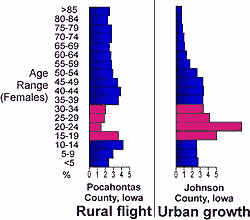

<!--yml
category: 未分类
date: 2024-05-12 20:07:02
-->

# Falkenblog: The Perennial Urban Allure

> 来源：[http://falkenblog.blogspot.com/2013/03/the-perennial-urban-allure.html#0001-01-01](http://falkenblog.blogspot.com/2013/03/the-perennial-urban-allure.html#0001-01-01)

Richard Florida is a popular speaker on city development. His theory is that hipsters and homosexuals generate the innovation of great cities like Manhattan and San Francisco. I think his theory is simply wishful thinking, unsupported by anything but anecdotal correlations, but in his

[latest defense](http://www.thedailybeast.com/articles/2013/03/21/did-i-abandon-my-creative-class-theory-not-so-fast-joel-kotkin.html)

 he makes the assertion that cities are essential to growth:

> Second, everyone who actually studies the subject—save Kotkin—agrees that cities and density spur economic growth... everyone seems to agree that denser cities and suburbs, denser metros and regions, add to growth...We know that cities and skills power growth

This reminded me of going back further, where I remember economic historians arguing that urbanization was key to the Enlightenment and the Industrial Revolution, and thereby, to modern civilization.

Yet if you read economic history, you'll see that cities have historically been considered genetic sinkholes.

[Robert Woods](http://www.jstor.org/discover/10.2307/3092733?uid=3739736&uid=2&uid=4&uid=3739256&sid=21101936215911)

estimated that life expectancy was 50% higher in the countryside up to 1800\. Even without infant mortality, it's generally assumed medieval cities would have disappeared except for in-migration.

So, why did most people want to move to the city? It seems like the same lure as today: freedom from a set life pattern and higher urban wages. I would like to think people are more motivated by self-actualization that comes from finding one's true niche in life, but looking at pop culture I think it's more simply a desire to socialize with peers (dancing, sleeping around, laughing with friends).  Even today, young people, especially women, flee rural areas for cities (see population density graph above right).  For centuries, young people think their best interests are served in a metropolis.

So, something generally considered essential for the group, urbanization, was for a millenium  harmful to the individual, yet still preferred by the individual. Either people pre-1800 were overconfident about their mortality, oblivious to the statistics, or as

[Epicurus said](http://unfspb.wordpress.com/2007/05/21/why-we-should-not-fear-death/)

, death isn't really something to worry about because if your dead you're not alive to worry about it, and if you are alive to worry you aren't dead so stop worrying.

People moving to the city have been illogical risk takers from the beginning. and the key is probably they like the sexual or mating opportunities inherent in large groups. Playing to that angle would bring in hipsters and gays. As to whether that's the key to the health of cities or our nation, I doubt it, but it won't hurt, especially because one of the best ways of making a city fun to go out in is that it's safe for young women.