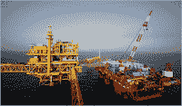

<!--yml
category: 未分类
date: 2024-05-12 23:07:53
-->

# Falkenblog: The Price of Oil in Mexico

> 来源：[http://falkenblog.blogspot.com/2008/07/price-of-oil-in-mexico.html#0001-01-01](http://falkenblog.blogspot.com/2008/07/price-of-oil-in-mexico.html#0001-01-01)

The US Oil companies are up for a lot of abuse. One of Obama's big line's on the stump is that Energy companies are getting rich, so we should impose a windfall profits tax on them. After all, if they didn't expect prices to rise, why should they make money on their inventory?

Well, Mexico is a nice example of what happens when your oil company loses money in such an environment. The government owns the gas company, PEMEX. PEMEX loses money most years,

[even this year](http://www.nytimes.com/2008/06/07/business/worldbusiness/07peso.html)

, when the cost of oil was 40% higher than anticipated. It should have been a revenue windfall.

How can this be? Gas is about

[$2 a gallon](http://www.msnbc.msn.com/id/25175249/)

cheaper in Mexico than the US. As their production falls (investment stifled because there's no profit in it), they found they had to buy oil to make up the difference, and so lost money because they 'have' to sell it at this ridiculously low price to their citizens. Bad for the environment too.

There are worse things than profits. Losses, for example.