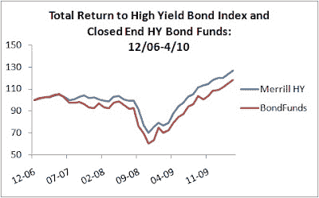

<!--yml
category: 未分类
date: 2024-05-12 21:33:40
-->

# Falkenblog: The Real Corporate Bond Return Puzzle

> 来源：[http://falkenblog.blogspot.com/2010/05/real-corporate-bond-return-puzzle.html#0001-01-01](http://falkenblog.blogspot.com/2010/05/real-corporate-bond-return-puzzle.html#0001-01-01)

High Yield bonds highlight the most fundamental problem in finance: that

[risk is not positively related to expected returns](http://www.efalken.com/video/index.html)

, and this fact is not empirically obvious. This strikes at the heart of finance, because 'risk' is a rationalization for many things, but after 50 years, remains like dark matter, a convenient assumption for an empirical 'anomaly'. For example, in Steve Cecchetti's

[finance textbook](http://www.amazon.com/Banking-Financial-Markets-Stephen-Cecchetti/dp/0073523097)

, he highlights the extra return to lower rated bonds (aka 'High Yield' or 'Junk') as evidence of the risk-return nexus. In theory, if you take higher risk you get a higher return, so its understandable he would be cavalier about an assertion that seems obvious.

Yet a stated yield just means this is what is promised in the no-default case, and so not the same as an expected return. Many bonds actually default, the more so the higher the stated yield. In fact, the correlation is such that if you look at actual returns, the risk premium disappears. This is complicated by the fact that indices, such as the

[Merrill Lynch High Yield Master](http://en.wikipedia.org/wiki/Merrill_Lynch_High_Yield_Master_II)

, show a nice 7.43% annualized return from December 2006 to April 2010 about 200 basis points higher than the BBB index. Yet actual high yield funds, and I used 25 different ones, generated a considerably lower 5.14% annual return over that same period. Not only is there a management fee (say 0.4%), but funds encounter costs transacting in their inventory, in terms of commissions, crossing the bid-ask spread, and price impact. The transaction costs here are multiples of that in equities, because there's less liquidity in this market. This adds up to a couple percent per year.

On average, B rated bonds have about a 320 basis point spread to Treasuries, but with a 6% average annual default rate, and a 50% recovery rate, that's about zero net forward return premium. Add in the extra expenses from these illiquid securities, and you would do better owning a savings account, because the high yield bond risk is much higher however you measure it (eg, beta, stdeviation of returns).

The

[conventional corporate bond puzzle](http://www.frbsf.org/publications/economics/letter/2010/el2010-06.html)

is that spreads are too high. The most conspicuous bond index captures U.S. Baa and Aaa bond yields going back to 1919, which generates enough data to make it the corporate spread measure, especially when looking at correlations with business cycles. Yet Baa bonds are still investment grade, and have only a 4.7 percent 10-year cumulative default rate after their initial rating. As the recovery rate on defaulted bonds is around 50 percent, this annualizes to a mere 0.23 percent annualized loss rate. Since the spread between Baa and Aaa bonds has averaged around 1.2 percent since 1919, this generates an approximate 0.97 percent annualized excess return compared to the riskless Aaa yield, creating the puzzle that spreads are too high for the risk incurred.

Yet this corporate risk premium puzzle pertains to one portion of the risk spectrum the difference between a 0.03 percent and a 0.3 percent annualized default rate, a distinction without a difference to most people. When one goes from a 0.3 percent to a 15 percent default rate, as one does when you go from BBB- to C-rated bonds, there is no return premium at all. The annualized return premium between the Merrill Lynch High Yield Index and that of their BBB-AA index is only 89 basis points annually since 1987, which is eaten up by fees, explicit and implicit. Junk bond investors take extra risk for no extra return.

It may be that individual investors expect high returns when investing in high risk assets, only that this is a mass delusion, the triumph of hope over experience. If so, that isn't the 'expected return' one talks about in academic finance, that is, a statistically rational expected return. It is important to think of a return premium as due to two things: randomness and alpha. Randomness or luck we all understand. Alpha, however, is a little trickier. It isn't something you can buy, because due to competition, no one sells it for less than cost, meaning, the insiders who structure and sell any alpha idea will take out all the extra return, leaving nothing at best, a mean-mode trade* at worst. To get alpha, you don't buy something passively, you have to actively negotiate, time, or structure an investment, and while people can help you, no one will singularly present you with an extra-normal return. Further, most alpha attempts are like karaoke ballads, well intentioned but ultimately awful, meaning, after fees most alpha is negative (how else do so many alpha-less brokers afford their nice cars!?).

It is difficult to see how the little risk is priced, the big one not, if risk is to have any consistent meaning. If the corporate spread is a function of risk at one end, why is it not at the other, more intuitive end? This is but another reason I think there is no general risk premium, as explained in my series of Camtasia videos on my book

[here](http://www.efalken.com/video/index.html)

.

* mean-mode trade: mode is positive, mean is not, as in selling underpriced out-of-the-money options.