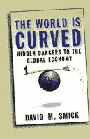

<!--yml
category: 未分类
date: 2024-05-12 23:01:39
-->

# Falkenblog: The World is Curved

> 来源：[http://falkenblog.blogspot.com/2008/08/world-is-curved.html#0001-01-01](http://falkenblog.blogspot.com/2008/08/world-is-curved.html#0001-01-01)

I got this note in my email about this book

[The World is Curved](http://www.theworldiscurved.com/TWIC_Excerpts.html)

by David Smick. I did not think much of it, but it said it was blurbed by Greenspan, Barton Biggs, Laurence Summers, Jean-Claude Trichet, and others. Then I find it was praised by about 50 of these types of guys, as if Davos had a session on writing blurbs for David Smick. See the quotes

[here](http://www.theworldiscurved.com/TWIC_Others.html)

.

So, I wondered around the site, and read the first two chapters. Something about how we are all interconnected, and the Chinese are going to have a lot of investing power, the market has been fluctuating a lot recently, financial instruments are complicated (things called 'collateralized debt obligations'). Most importantly, though Thomas Friedman's book the World is Flat is GREAT, he says, the world is actually

curved

(who knew?), because things change unexpectedly (hey, Taleb, he stole your idea!). Lastly, the author talks to all sorts of smart, powerful people ("Friend of mine at the Fed say...").

This book riffs on so many cliches (we are at a tipping point) in a way that just mentions current trends

ad nauseum

, as if listing the trends and facts of financial markets somehow awes me into an appreciation that this collection of observations has a point, other than, the world is complicated, and though it may get better, it may get worse. Like many of these types of books, he seems to think he clarifies things by mentioning lots of varied facts, or some banal observations are really profound (eg, capital flows: important). He did not get to his point in the two first chapters of his book, perhaps its at the end ('plastics', or something).

But the list of advanced praise highlights a bad equilibrium in book blurbing. I can't imagine these people read the book and felt the way they did. Did Lawrence Summers really say "He writes in a way that makes giving close attention a pleasure."? Did Stan Druckemiller really write "It's a 'must read'"? If you think stock analysts were in cahoots with the investment banks, then the book blurbing industry is that situation raised to the google power. And if this is a 'must read' according to the Davos crowd, it clearly highlights the champagne was flowing, and its scary to think these guys are making the key decisions at the Fed, White House, etc.