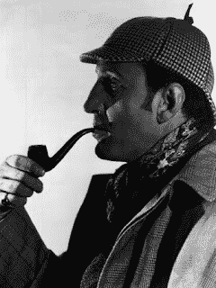

<!--yml
category: 未分类
date: 2024-05-12 20:32:54
-->

# Falkenblog: Theory vs. Data

> 来源：[http://falkenblog.blogspot.com/2012/03/theory-vs-data.html#0001-01-01](http://falkenblog.blogspot.com/2012/03/theory-vs-data.html#0001-01-01)

One interesting interpretation of Freud is that he modeled his approach based on his readings of Sherlock Holmes (see

[Sebastiano Timpanora](http://www.amazon.com/The-Freudian-Slip-Psychoanalysis-Criticism/dp/1859844901)

). In those books, Holmes would trace the faintest clues and infallibly solve a puzzle that would daunt your average person. Freud then though if he could supply a dynamic explanation for virturally every reported dream or error, the soundness of his method would be demonstrated, so Freud's case studies read a lot like a fun mystery novel. It turned out detective stories are a bad template for creating a new science because it is all

post hoc

rationalization, and unfalsifiable, basically the signature field

[Karl Popper used](http://www.stephenjaygould.org/ctrl/popper_falsification.html)

to explain what is not a science.

Our narrative brain theorizes and is often wrong, but of course it does the best it can. Interestingly, the left side, the language side, is the theorizer. Thus, if you show the left brain a sequence of lights that flash above the line 80% of the time, rats and pigeons and 4-year olds do better than adults because our left, theorizing side, tries to guess which one will be above or below the line, matching only the relative frequency, but wasting many choices below the line. We basically become dominated by our wacky, theorizing left side around age 5, which as any parent will tell you, is well before reasoning has been perfected.

In contrast, if you merely show the pattern to the right side of the brain, as Michael Gazzaniga has done with his studies of split-brain patients, the right side is a simple bayesian, and goes with the frequentists approach (see his book

Who's in Charge?

). So, half our brain is a simple bayesian looking at data without much theory, the other half a theorist trying to integrate, analyze, and generalize.

Freud was only doing what is natural, coming up with theories, but he forgot that old cliche, moderation in all things. Look at the data too. If they contradict your theory, or cannot be really contradicted by data, alter your theory. The problem seemed to be that Freud was always the smartest kid in the room growing up, so he probably thought he could simply make up anything at all, because he could argue for or against anything with complete confidence he would win as he always did. Unfortunately he learned fake thinking, the kind salesmen, lawyers and politicians are especially good at, which is reasoning and arguing without a prioritization of the truth. For him the truth was merely a tactical constraint, a concession in small facts, never for the big one.