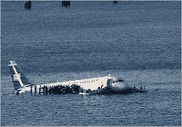

<!--yml
category: 未分类
date: 2024-05-12 22:35:49
-->

# Falkenblog: They Didn't Use the Seat Cushions!

> 来源：[http://falkenblog.blogspot.com/2009/01/they-didnt-use-seat-cushions.html#0001-01-01](http://falkenblog.blogspot.com/2009/01/they-didnt-use-seat-cushions.html#0001-01-01)

For decades, the preflight instruction would mention using the seat cushions as a flotation device in case of a water landing. I have yet to hear about this tactic actually working, or even tried. The guy who sold the industry on this for his company should be in the Marketing Hall of Fame.