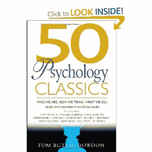

<!--yml
category: 未分类
date: 2024-05-12 20:09:29
-->

# Falkenblog: Too Many Axioms?

> 来源：[http://falkenblog.blogspot.com/2013/02/too-many-axioms.html#0001-01-01](http://falkenblog.blogspot.com/2013/02/too-many-axioms.html#0001-01-01)

I stumbled upon a website that listed

[61 common behavioral biases](http://www.businessinsider.com/common-behavioral-biases-2012-5?op=1)

,  and most of them seemed good to know, unfortunately.  I guess there are so many because we are constantly using heuristics to explain and predict, and of course these heuristics are often applied incorrectly, in the same way we think people from large countries or states far away know each other or get along (eg, I remember when I got to college, and being from Cleveland someone said to me, 'Do you know Joe down the hall? He's from Cincinnati.').  Simple errors, good to rectify. As there are as many different patterns we try to project on little information in life, it's understandable we have so many biases.

In that vein, I was strolling through Barnes and Noble and found this little book,

[50 Psychology Classics](http://www.amazon.com/50-Psychology-Classics-Insight-Inspiration/dp/1857883861)

, for only $7.98\. 50 seems like a lot, but luckily this book was only 200 pages, so the author did an admirable job boiling down these big thinkers into some key ideas.  Understanding how we think is pretty important, and we don't have one big drive, rather, many.

While it would be nicer if James, Freud or Jung had it all right in their magnum opuses, it's more probable the best ideas in psychology are from many different thinkers. Here's some good ideas I cribbed from that book:

**Alfred Adler**

: Noted that character involves a balancing the desire for power and that for social togetherness, and that the hardest thing for human beings to do is know themselves, and then to change themselves.

**Eric Berne**

: Humans need social contact more than anything, and we seek it primarily in symbolic emotional strokes. This often breaks down into interactions and games that are repeated, such as going over sports scores. It may seem banal, but it is no less comforting than the soft strokes given to a baby.  We have three selves--the parent, adult, and child. All are necessary, but the adult way best in most cases.

**Robert Bolton**

: Most communication is non-verbal. Learn to listen, mainly by truly wanting to hear what the speaker is saying (then don’t interrupt, encourage elaboration).

**Eric DeBono**

: Creative thinkers use a variety of strategies to think outside the box: generate alternatives, challenge, assumptions, use analogies, find the dominant idea, suspend judgment. A great insight should be obvious after discovered.

**Nathanial Branden**

: Neurosis occurs when we let our feelings dictate our thoughts and actions. It is impossible to be both happy and irrational. Live by reason.

**David Burns**

: Cognitive therapy notes that our thoughts affect our emotions and mood, not the other way around. It isn’t events that dictate your mood, but how you react to events.

**Mihaly Csikszentmihaliyi**

: Creative breakthroughs come after years of hard work and attention to detail. First you need to master a domain, then you can break those rules you understand to create something new.

**Erik Erikson**

: Young people need to really believe in something intensely before they hate it. The real crisis in a person’s life often comes in the late 20’s when they realize they are overcommitted to a path that is ‘not them.’ It’s often too late.

**Victor Frankl:**

The greatest human achievement is not success, but facing an unchangeable fate with courage. The will towards meaning is at least as important as the will to power, and one's meaning differs depending on the issues and opportunities unique to our particular time and talents.

**Daniel Gilbert**

: Humans are the only animals that plan for the future by trying to anticipate, not by instinct, but via mental modelling. We often overestimate how things and money will change our happiness.

**Thomas Harris:**

‘I’m OK you’re OK’ is like the Christian concept of grace: total acceptance of oneself and others. Successful people assume others are equals from whom they can learn valuable things.

**Eric Hoffer:**

Faith in a holy cause is often a substitute for a lost faith in oneself. People join movements for a sense of belonging, or from a feeling of boredom. When glorious ends justify any means, believers will do horrible things to create their paradise.

**William James:**

We can never have exactly the same thought more than once, because over time we know more, have reacted to it already, know what others now think about that thought, etc.

**Abraham Maslow:**

Instead of trying to create better things, we should try to create societies with more self-actualized people. Such people have a  guilelessness, do things that occasionally are unpopular, work hard at what they are best at, and try to see others in their best light

**Jean Piaget**

: Children seem very social, but actually they are egocentric maniacs, and tend to talk a lot to no one in particular, often performing a monologue on their actions. Only madmen and children say whatever they think, because they think only they matter.