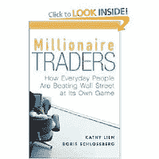

<!--yml
category: 未分类
date: 2024-05-12 22:22:12
-->

# Falkenblog: Trader Book Gets Taken by Fraud

> 来源：[http://falkenblog.blogspot.com/2009/02/trader-book-gets-taken-by-fraud.html#0001-01-01](http://falkenblog.blogspot.com/2009/02/trader-book-gets-taken-by-fraud.html#0001-01-01)

[Millionaire Traders](http://www.amazon.com/Millionaire-Traders-Everyday-People-Beating/dp/0470049472/ref=sr_1_1?ie=UTF8&s=books&qid=1234734244&sr=1-1)

is a book in the tradition of Jack Schwager's Market Wizards, except instead of using famous traders, it uses 'regular guys'. Alas, how do you find these people? Why, go to internet sites where people promote their millionaire methods. Any auditing of results? No. Thus, it should come as no surprise they were taken. One of their subjects, Charles Hays, turned out to be

[running a Ponzi scheme](http://www.startribune.com/business/39575827.html?elr=KArks:DCiU1OiP:DiiUiD3aPc:_Yyc:aULPQL7PQLanchO7DiUr)

.

> The book paints a radically different picture of Hays than the one that has come out in federal court this month, where federal prosecutors now say he was the operator of a Ponzi scheme and a trader who lost money 20 out of 24 months. The expanding investigation has found 75 people who lost at least $25 million entrusting their money to Hays, prosecutors say.
> 
> The world Hays built held the trappings of a market wizard: his house, set in a wooded section of Rosemount; his reputation among day traders, built in part by the 33-page "Millionaire Traders" profile, and his $3 million, 64-foot Viking cabin cruiser.

He would trade the S&P500 (minis) for an hour a day in the morning, and supposedly generate a 3% monthly return to investors. Uh huh.