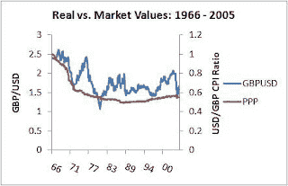

<!--yml
category: 未分类
date: 2024-05-12 20:37:48
-->

# Falkenblog: True Value Weak Guide

> 来源：[http://falkenblog.blogspot.com/2011/12/true-value-weak-guide.html#0001-01-01](http://falkenblog.blogspot.com/2011/12/true-value-weak-guide.html#0001-01-01)

I remember seeing an update of investment bank analysts, and they separated their ability into two groups: those good at predicting earnings, and those good at predicting stock prices. There wasn't much overlap. So I found a spreadsheet from a colleague's thesis that looked at the Pound/dollar exchange rate from 1973-2005, and noted while there was a pretty boring pattern in purchasing power parity ratio, but the market's value of the pound against the dollar fluttered around it quite a bit. It seems that if for some reason you were the only person in the world who knew the inflation rates in these two countries, your investment strategy would only be marginally attractive.