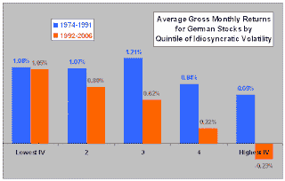
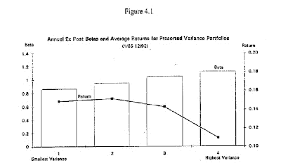

<!--yml
category: 未分类
date: 2024-05-12 21:28:13
-->

# Falkenblog: Volatility and Returns in the Long Run

> 来源：[http://falkenblog.blogspot.com/2010/07/volatility-and-returns-in-long-run.html#0001-01-01](http://falkenblog.blogspot.com/2010/07/volatility-and-returns-in-long-run.html#0001-01-01)

A recent

[paper](http://www.cxoadvisory.com/volatility-effects/negative-idiosyncratic-risk-premium/)

looks at volatility in German stocks in the long run. Stefan Koch documents that high 'idiosyncratic' volatility firms have lower returns than high idiosyncratic firms. Now, these are actual returns, not expected returns, so, they aren't proof of anything according to some. But theoretically, expected returns (population means) converge to actual returns (sample means) in the long run. I suppose like the Soviet Union and it's 70 years of bad weather, the globe had an anomalous century in every developed country. Looking at data from 1974 through 2006, the result is the following chart.

This confirms the results in

[Ang, Hodrick, et al (2009](http://www2.gsb.columbia.edu/faculty/aang/papers/ivol.pdf)

), but that had data only going back to 1980 in Deutschland, and as a German, Stefan was probably more careful about this analysis (it was one country among many for Ang

et al

). I suppose every country will find this same pattern upon close examination, as opposed to some freak finding by some careless researcher.

I suppose also the academic conventional wisdom is that volatility is inversely correlated with risk via a correlation with higher moments or information dissemination. When the experts start this kind of crazy-talk--that total derivatives have opposite sign of partial derivatives because of some feedback loop--you know they are in an intellectual dead-end, oblivious to the absurdity of their statements. Let me qualify: I agree that many things, like some charities, often have perverse consequences; but then I would never also assert that such charities are beneficent. If risk is reduced by systematic and idiosyncratic volatility via these effects, then 'risk' means something quite different than what is implied by Markowitz or his progeny (eg, the Stochastic Discount Factor). It may work in holding off the inevitable until they retire, but in their dotage they'll be like Marxist profs seeing the collapse of the Soviet Union, and while they may have ruled the roost in their day their work will be irrelevant.

My

[dissertation in 1994](http://www.efalken.com/papers/EF%20Dissertation.pdf)

was on idiosyncratic variance and total return. I found, and continue to find, that idiosyncratic variance, total variance, even beta, were/are all inversely related to returns. It does not matter which metric of volatility you use, you get the same pattern.

The main idea at that time, was that beta was mismeasured (it was time varying, the true index was proxied imperfectly by the S&P500), leading to weak evidence of the beta-return nexus. Yet as mismeasured betas should show up in the residual, or idiosyncratic variance, it was a puzzle that this residual was actually inversely related to returns. I found great skepticism if not simple disbelief in my results, as they thought it was some sort of measurement error, or some omitted variable that made actual returns inversely correlated with expected returns. I tried to motivate my finding by noting that mutual funds disproportionately invested in the more volatile stocks, which made sense given the convex relation between fund inflows and mutual fund returns, but this was before Freakonomics or popularity of investor biases, so partial equilibrium stories were not considered worthy as an explanation back then. More evidence, if needed, that what counts as kosher for a science is not some logical necessity, but rather what's popular amongst practitioners, the current zeitgeist's ephemeral definition of 'rigorous science'.

That I was correct on something new and important highlights, it's not a good thing to be too ahead of one's time. I got no fly-outs for an academic job, so my professional life went a different way, and as I'm pretty blessed now I wouldn't want it any different. But it's interesting that true facts, when you find them, have a tendency of showing up independently again and again.