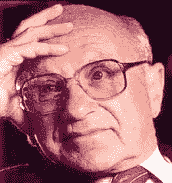

<!--yml
category: 未分类
date: 2024-05-12 21:22:10
-->

# Falkenblog: Was Friedman Right on Markowitz?

> 来源：[http://falkenblog.blogspot.com/2010/09/was-friedman-right-on-markowitz.html#0001-01-01](http://falkenblog.blogspot.com/2010/09/was-friedman-right-on-markowitz.html#0001-01-01)

Harry Markowitz’s 1950 dissertation on portfolio mathematics was the basis for his Nobel Prize in 1990\. At the time his dissertation advisor Milton Friedman thought it contained too much statistics as opposed to economics because it focused on algorithms to determine the portfolio weights for the efficient frontier. Nothing stings like the lukewarm approval of men we respect, and so in a scene surely envied by many a thesis advisee, Markowitz noted in his

[Nobel lecture](http://nobelprize.org/nobel_prizes/economics/laureates/1990/markowitz-lecture.pdf)

:

> *When I defended my dissertation as a student in the Economics Department of the University of Chicago, Professor Milton Friedman argued that portfolio theory was not Economics, and that they could not award me a Ph.D. degree in Economics for a dissertation which was not in Economics. I assume that he was only half serious, since they did award me the degree without long debate. As to the merits of his arguments, at this point I am quite willing to concede: at the time I defended my dissertation, portfolio theory was not part of Economics. But now it is.*

It is understandable that Friedman found the nuts and bolts of generating the efficient frontier of little relevance to economics, as with hindsight the efficient frontier in return-standard deviation space has

nothing to do with

risk according to the latest general equilibrium models. Further, no one has ever used this method of generating portfolios because in practice returns do not increase as a function in volatility or correlation.  Markowitz’s big idea was merely the benefits of diversification, which is a good idea, but simple enough and hardly novel (the idea was mentioned in the Bible and by Shakespeare--but that didn't stop

[Telluride Asset Management](http://www.tridecap.com/)

from

[suing](http://www.efalken.com/papers/legaldocs.html)

to keep me from applying the top-secret idea of mean-variance optimization).

As the vast majority of Markowitz's early work focused on algorithms that turned into a dead end, I think Friedman’s intuition has been vindicated: the efficient frontier, and therefore how to get there, is irrelevant.

There's always the hope that, like

[Wile's proof of Fermat's Last Theorem](http://www.pbs.org/wgbh/nova/proof/wiles.html)

, a complex three-day proof exposes an insight of incredible depth and profundity, an idea that that requires some specialized technical knowledge, as this would vindicate the method of those with their technical knowledge. Great classical music is an example of something that validates rigorous study because if you study music rigorously you appreciate it more. Alas, it rarely works that way.

Bottom line: diversification is still good, but volatility is not priced risk (and Friedman, as usual, was right).