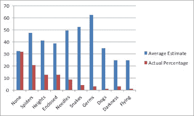

<!--yml
category: 未分类
date: 2024-05-12 20:43:09
-->

# Falkenblog: We are the 99%!

> 来源：[http://falkenblog.blogspot.com/2011/10/we-are-99.html#0001-01-01](http://falkenblog.blogspot.com/2011/10/we-are-99.html#0001-01-01)

Egalitarians may be a majority, but they aren't close to 99%. This reminds me of the False Consensus Effect, which states that individuals view their own preferences, behaviours and judgements as being typical, normal and common within a broader context; it also suggests we find alternative characteristics as being more deviant and atypical than they actually are.

The blogger Psycasm

[did a survey](http://www.labspaces.net/blog/1484/Beware_the_False_Consensus_Effect_)

, and asked them about their phobias, and compared them to what they supposed the percent of people shared these specific phobias, and got these results:

So, people who are afraid of spiders, dogs, and heights, vastly overestimate the prevalence of their specific phobia. Sort of like how economists, who have no alpha and are inclined to statistical optimization, assume

**all**

investors would invest as they would: presuming no alpha, optimizing mean-variance preferences. It's not a problem limited to proles.

I feel pretty calibrated, in that I'm pretty aware of my many beliefs that are a distinct minority. It doesn't bother me too much because I believe in meritocracy, which is inherently elitist. This not only is a minority view (at least in public), but it by definition considers 'common' to mean 'crappy' in most cases. As Aristotle noted, just because people are equal in some respects does not imply they are equal all respects; men are equally free, but not absolutely equal

We are a democracy, which means majorities elect the lawmakers, so it is important to have a majority opinion, especially if you want to pass laws that make people do what they would otherwise not (eg, pay more to strangers in Washington, not marry their partner, not own a gun). But there's no reason to brag about it, because it's merely a sign you can be a bully, not that you are somehow more enlightened:

> The fact that an opinion is widely held is no evidence whatever that it is not utterly absurd; indeed in view of the silliness of the majority of mankind, a widespread belief is more likely to be foolish than sensible.
> ~Bertrand Russel
> 
> To disagree with three-fourths of the British public is one of the first requisites of sanity.
> ~Oscar Wilde