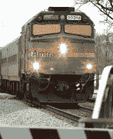

<!--yml
category: 未分类
date: 2024-05-12 21:45:12
-->

# Falkenblog: What Does Something Really Cost?

> 来源：[http://falkenblog.blogspot.com/2009/10/what-does-something-really-cost.html#0001-01-01](http://falkenblog.blogspot.com/2009/10/what-does-something-really-cost.html#0001-01-01)

Any large institution has problems allocating 'fixed costs'. That is, I remember going over budgets, and certain functions, like headquarters, the CEO's salary, Treasury, was a 'fixed cost'. More problematically, you had many sunk costs, businesses we were exiting, that were obviously losing money (otherwise we wouldn't be exiting them). Each individual unit could be making money, but once we paid for the fixed costs and costs of the businesses we were winding down, the corporation was underperforming on a Return-On-Equity basis. As a corporation, you have to allocate all your costs to see if you are doing right by your shareholders.

For a government, it is much worse, because they do not have a balance sheet. Very few in government know how much anything costs. They just pass the law, and look at the marginal expenditure. Like the Social Security Trust fund, they operate using rules that would be illegal if done in the private sector. The market is a heartless thing, but at its core it makes sure that when people get more out of what they put in (profits), they do more; if they get less (losses), the do less or not at all. That's efficiency.

So when a

[private study](http://www.wtop.com/index.php?nid=111&sid=1795397)

reported that each Amtrak passenger costs taxpayers(ie, over the passenger payment) $32,

[four times](http://subsidyscope.com/projects/transportation/amtrak/)

Amtrak's estimate of $8\. Oops. Further, the subsidy ranged from

[$4 (Boston to Washington DC) to $462(LA to New Orleans)](http://subsidyscope.com/projects/transportation/amtrak/)

. Clearly, the higher costing routes seem ripe for exit, but it would be naive to think that is being considered.

Ludwig von Mises said the main reason capitalism would outperform socialism, is because in socialism no one knows how much anything costs, which makes it impossible to allocate resources efficiently. The Amtrak study highlights they don't know, and they don't even think it matters.