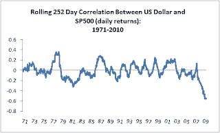

<!--yml
category: 未分类
date: 2024-05-12 21:20:19
-->

# Falkenblog: What's with the US Dollar/Equity Market Correlation?

> 来源：[http://falkenblog.blogspot.com/2010/09/whats-with-us-dollarequity-market.html#0001-01-01](http://falkenblog.blogspot.com/2010/09/whats-with-us-dollarequity-market.html#0001-01-01)

Lately, the US dollar and the US stock market have been in lock-step. Below are the S&P500 and the US currency ETF "DBV". You don't need statistics to see they are highly correlated (why a good graph is better than a good statistic!).

It has not always been this way. Looking at the rolling correlation that looks at the past 252 daily returns, using the dollar's value against the major currencies (see

[here](http://www.federalreserve.gov/RELEASES/h10/Summary/)

) prior to 1995, and the

[trade-weighted dollar subsequently](http://www.federalreserve.gov/RELEASES/h10/Summary/indexb_b.txt)

. This currency index has higher values for a lower value of the dollar, opposite to DBV ETF, but the important point is that current dollar/equity correlations are at an all-time absolute high. The dollar is now driving the stock market--or vice versa--at an unprecedented level. The implications, to me, are not obvious. [addendum: commenter John noted that DBV is a carry trade ETF, not a currency value ETF. So, I still don't know what's going on, but at least I'm not as confused as before]

