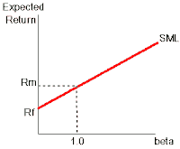
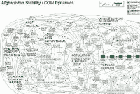

<!--yml
category: 未分类
date: 2024-05-12 21:13:23
-->

# Falkenblog: When People Agree for Different Reasons

> 来源：[http://falkenblog.blogspot.com/2010/12/when-people-agree-for-different-reasons.html#0001-01-01](http://falkenblog.blogspot.com/2010/12/when-people-agree-for-different-reasons.html#0001-01-01)

Among people who might agree with me on various issues, it is usually for very different reasons. Consider the many reasons people are for abortion or tax cuts. People often focus upon those who agree on their goals, and dismiss the reasons why as uninteresting details. This has pragmatic merit (Keynes's dictum that 'everything is always decided for reasons other than the real merits of the case'), but it highlight the tenuous foundation of our beliefs.

Harvard Law professor Noah Feldman just wrote a book--

[Scorpions](http://www.youtube.com/watch?v=4Adcmtagtd4)

--about the Supreme court justices from when President Franklin Roosevelt was battling to get his radical initiatives implemented in the 1930's. The Supreme court presumably constrains the executive and legislative branches based on whether their conduct or laws are 'valid'. Very smart people study law to decide whether things are 'legal', and then try to convince judges various actions or laws are valid.

He notes all the justices were very smart and driven, and most importantly key supporters of the New Deal. While they disagreed on almost everything (ergo 'scorpions in a bottle'), they arrived at similar conclusions through quite varied philosophies. William Douglas was results-oriented, Robert Jackson relied on constitutional principles, etc. In other words, they all agreed on the answer, just not why it was correct.

The 'why' matters for a host of reasons: it can point to other applications, and suggest the degree of arbitrariness in the decision. For example, if one person doesn't want to rob me because he fears punishment, another because he thinks it is morally wrong, I'm going to try to stay away from the guy whose only fear is the police.

Feldman praises the justices for their role in helping the high court deliver the landmark desegregation decision, Brown v. Board of Education. He contends that their willingness to “break [philosophical] rules of their own,’’ was good because they learn the art of politics from FDR. Not only did they all have different legal principles, they would break these when convenient, highlighting the profound goodness of these men. Well, what if they justified a law you didn't like that way? There seems to be a total absence of principle among these legal titans.

[Jonathan Haidt highlights brain research](http://falkenblog.blogspot.com/2008/09/why-education-and-intelligence-dont.html)

that shows people make decisions first, often unconsciously, then confabulate answers, and they've done this with people whose brain's corpus collosum has been severed and showing things to one eye, ask them to point with the other hand, etc. He likens the conscious confabulator and the unconscious decider of our selves to an elephant and its rider. The rider represents the 'controlled' processes of the mind, the planning and reasoning that takes place one step at a time in conscious awareness, while the elephant represents the hundreds of automatic operations we carry out every second outside of conscious awareness. Over time, the rider can influence the elephant, but never always, and only so much.

This highlights that all people develop beliefs via a process of 'anything goes'. Reality has its constraints, mainly because it is easier to argue for things that are true than untrue--but it's not impossible to argue for things that are false, or even really hard. As Paul Feyerabend argues in his great book

[Against Method](http://www.complete-review.com/reviews/lakatosi/fandam.htm)

, there is no singular method to science any more than there is single method how a child comes to understand the world: from tradition, direct experience, command, advice, instinct, reading, etc. Surely children learn much more quickly than adults, most of it true, and do so in a very unstructured way. They are on the whole quite ignorant, but importantly, our betters at 'learning'.

When people say their ideas are based on reality, science, rigorous proof, or statistics, they just mean they think their ideas have convincing articulations to some people they respect. They are naive if they think that any mildly complex idea is unambiguously true according to some unimpeachable proof. There are just too many assumptions and implications in any assertion for one to say A is apodictically better than B. Sure, you can come up with simple examples of ideas where the alternatives are silly, but consider most issues people disagree upon--specific tax rates, welfare policies, environmental regulations, criminal statutes--and you will find smart, educated persons on both sides of the debate.

Remember that the economic profession became pretty convinced in the empirical validity of the

[CAPM](http://en.wikipedia.org/wiki/Capital_asset_pricing_model)

(recounted

[here](http://www.efalken.com/papers/RRsec1.html)

), over the period 1965 to 1985\. Fama and MacBeth, and other seminal papers documented the Sharpe/Linter/Mossin model of how covariance with 'the market' determined expected, and thus average, returns. Miller and Scholes (1972) did

[empirical work](http://www.efalken.com/papers/RRsec2.html)

on the CAPM where they controlled for changing interest rates, volatility, measurement error, residual volatility, and skewness, what appeared to be 'everything'; they did just forgot to control for size, which Fama and French (1992) showed got rid of any beta correlation with returns. You simply can't control for everything, so it seemed pretty convincing at the time. This merely highlights what counts as 'proven' is always ignoring some inconsistency, even when the theory is true (as one wag said, no theory is consistent with all the facts, because all the facts aren't true!).

The progressive faith circa 1900 that all we needed was education to create a better world seems like one of those naive beliefs in socialism. The same truths would become obvious to everyone. The problem is, you can't teach common sense, and even those who have it have idiot-savant status, such as when the brilliant surgeon is a conspiracy theorist, or a great labor economist who is a poor macroeconomist. I know I have both good and bad ideas, but alas don't know which are which so I'm stuck with both. You could say, just don't believe in anything much, but that would leave me catatonic, unable to decide the most trivial thing because of the infinite reasons for and against anything.

Oscar Wilde said 'the man who sees both sides of a question is a man who sees absolutely nothing at all', meaning, you have to take a risk, assume something is true in spite of its unprovability, and act--at least tentatively--otherwise you really are in a state of precognition, as when a naive researcher looks at a bunch of data without focus, seeing nothing. To focus is to theorize, to form model of what is important and how things are measured and interact, and our education gives us many tools to do this. But as in geometry where sometimes you assume parallel lines meet, sometimes not, so too with all assumptions and criteria, and the justification is always somewhat arbitrary.

I'm not some sort of Derridean postmodernist, I just know that at the end of the day, people will probably agree or disagree with you for reasons other than what you articulate. I just try to remember that having good prejudices is as important as the having good empirical evidence--eg, the prejudice that risk and return are not related in asset markets--and so work on those as well as remembering how best to calculate corporate default probabilities. Think of your prejudices as your ultimate strategy that dictates your tactics.

It's good to have good reasons they help find these true ideas more efficiently; there just isn't one rational method, or even meta-method.

A good method for justifying your beliefs--say applying GMM to a utility function, economists love that!, or flow charts if you are a sociologist--will bring along interlopers who may not have an interest in your specific outcome, but rather, like your application of some methodology, and become a kindred spirit that way, helping your cause and career.

Free competition among people's services, goods, and beliefs is all that tends to make most centuries a little better than the prior one, and forces us to generate better services, goods, and ideas. Truth, like low prices, is not the result of an individual, but rather the byproduct of our collective interaction.