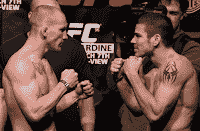

<!--yml
category: 未分类
date: 2024-05-12 20:07:50
-->

# Falkenblog: When Smiling is Beta

> 来源：[http://falkenblog.blogspot.com/2013/03/when-smiling-is-beta.html#0001-01-01](http://falkenblog.blogspot.com/2013/03/when-smiling-is-beta.html#0001-01-01)

After amateur wrestling, my favorite sport is MMA and last weekend's bouts were pretty good (winner Georges St. Pierre's face looked pretty beat up). It's good to know the scientists are mining it for data on the human condition. Chimpanzees smile to show submission to higher status males, and it seems we aren't so different. Some

[psychologists](http://bps-research-digest.blogspot.com/2013/03/smiling-fighters-more-likely-to-lose.html)

looked at 76 snapshots of fighters in their pre-fight publicity stagings, and found those who smiled more were less effective; losers smiled twice as often as winners.  The losers either rationally anticipated losing, or psyched themselves out.

Whilst one might think you should smile less to succeed, beware: smiling is

[associated with happiness](http://www.psychologicalscience.org/index.php/publications/observer/2010/december-10/the-psychological-study-of-smiling.html)

and a longer life, quality and quantity.  The important difference being that smiles associated with longevity are Duchenne smiles, that is, those that involve the whole face not just the mouth.  Basically, if you are truly happy, you smile more and live longer.  The smile shown by the losing fighters was the submissive, non-Duchenne smile.

Your default should be to smile; but if you feel like forcing a smile before a fight, your odds aren't so good. This is all statistics, mind you:

[Johny Hendricks](http://bleacherreport.com/articles/1570530-johny-hendricks-vs-carlos-condit-full-fight-video-highlights-from-ufc-158)

smiles a lot in warm-ups, and he wins a lot too.