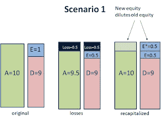
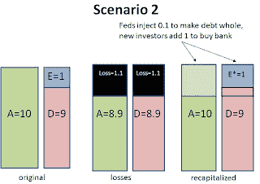
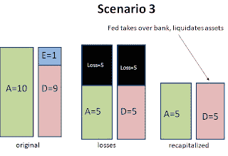

<!--yml
category: 未分类
date: 2024-05-12 22:18:07
-->

# Falkenblog: When and How to Recapitalize Banks

> 来源：[http://falkenblog.blogspot.com/2009/03/when-and-how-to-recapitalize-banks.html#0001-01-01](http://falkenblog.blogspot.com/2009/03/when-and-how-to-recapitalize-banks.html#0001-01-01)

In this crisis, the problem of how, and when, to recapitalized banks, is forefront. Several assume that the market, or the government, should merely add equity. This is often conflated with 'nationalization', but really we are not contemplating the US government actually buying and running banks prospectively. They are really considering various ways of become silent partners.

In any case, the recapitalization issue really falls into three separate cases that should be handled differently. Let us examine the case where this is prudent. In

scenario 1

below, the bank starts out with a traditional 10% equity ratio, or 10 to 1 leverage. This is a 'safe' level of equity, in that it is sufficient for both regulators, that is, by law, and for debtholders, that is, by the market.

If there is a loss of 0.5 'units', we now have an undercapitalized bank. Both regulators, and debt holders, are unhappy with this state of affairs. In this case, the optimal thing to do is merely let the market recapitalize. Equity owners are unwilling to lose the franchise value of the bank, say from brand name and existing customer relationships. So, they are willing to appease regulators and debtholders by accept dilution to maintain the little value they have. One might facilitate this via the Meltzer plan, of having the government match fund equity investors. The bottom line is that equity owners, that is, those who direct management, will agree to this remedy.

In

scenario 2 below

, the bank starts out again with 10 to 1 leverage, but loses enough value (say 1.1 units) via write-downs so that the bank is insolvent, its debts are worth more than the assets. In this case, the government may wish to make the debt holders whole to retain the franchise value of the bank. Equity owners are wiped out, however. That is, all they need do here, is put in 0.1 units, and then equity owners are willing to add the other unit. This cost of 0.1 units, is less than if they acquired the bank, and sold off the pieces. There is a significant going concern value that is preserved if the failed bank is sold to another bank, the main way a bank is recapitalized, compared to if the bank is merely liquidated by the government. These losses are twofold. First, there is the value loss from exiting customer relations that are now reassigned, and brand value of the bank (really, capitalized future customer relationships. Secondly, the government is probably a less efficient in liquidating assets than the private sector because they do not have an incentive to merely maximize the return on the bank assets. These costs are large and significant, and was documented in examining the S&L crisis in the late 1980's (see

[Christopher James, Journal of Finance, Sep 1991](http://www.afajof.org/journal/jstabstract.asp?ref=11153)

).

In

scenario 3 below

, the losses are so large (say 5 units), no amount of equity infusion would be greater than any gain from maintaining the franchise value, or avoiding the extra costs of relative government inefficiency. If the government burns, say, 1 unit of franchise value, and also 1 unit via their incompetence, this is 2 units, still better to wipe out the bank and sell it off as opposed to paying debt owners 5 units to save the 2\. The optimal action if for the bank to be simply acquired by the government, small depositors are made whole but bank bond owners lose principle.

For banks that are presumed insolvent, the question is whether the loss is sufficiently small so that it is less expensive to taxpayers to maintain its franchise value. The crucial question, therefore, is whether banks are solvent given their

current values

, not in some stress test. The adequacy of capital refers to scenario 1, but this should be self-correcting, because equity owners will accept dilution in order to avoiding losing franchise value. Insolvent banks need government action, but there is a difficult decision about liquidation versus bailing out bank debtholders, and here one should focus on the current value of the assets, and the bank's franchise value, as opposed to a stress test.

The Treasury should tread lightly, because a currently solvent bank that is merely undercapitalized under

certain hypothetical scenarios

is like a bank who is technically insolvent when one writes off Goodwill. This latter scenario resulted in several billions of US liability in the S&L crisis, as several banks found that changing the rules on bank goodwill merely destroyed an accounting contrivance, in the process creating a bank that violated the regulatory requirements and destroyed the bank's franchise value because by law it had to be taken over, even though equity and debt owners were willing to operate the bank. Destroying a bank's franchise value in such a manner destroys real value, and the courts agreed with this. It is not the legal liability I am concerned with, rather, the suboptimality of destroying bank value, from the relative inefficiency of government bureaucrats or the franchise value loss.

A zombie bank is like scenario 3 where the bank is not shut down by the government. The government keeps it alive, via forcing debtholders to renegotiate their terms, but the bank is insolvent no new equity owners are forthcoming. The bank owners, afraid of losing the option value of their ownership, merely wait for inflation to make the nominal value of assets rise above the value of the debt, but if inflation remains low, this may take a long time. Interestingly, in these situations, the small amount of equity does not generate the inordinate risk taking from taking advantage of the 'heads I win, tails the government loses' approach to the bank, but rather, a timid owner waiting for nominal prices to make the bank solvent.

The key is that for solvent banks one might think match funding equity infusions is worthwhile, and indeed it seems reasonable to assume that such an investment will be ok, because investors are also investing new capital on equal terms. But for insolvent banks, the only way to get the capital ratios back to solvency involves government injections, not mere match funding. No equity owner will take scenario 3 back to solvency, because investing 5 units to bring it back to normal, would be a transfer of 4 units to the debt owners, meaning, new investors would add 5 units to get 1 unit of bank ownership, a poor investment relative to buying stock in a solvent bank, of which there are many.