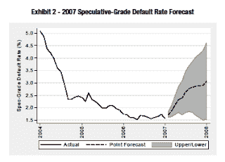
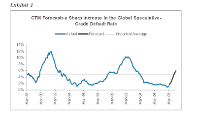

<!--yml
category: 未分类
date: 2024-05-12 22:50:08
-->

# Falkenblog: Where are the Non-Financial Defaults?

> 来源：[http://falkenblog.blogspot.com/2008/11/where-are-non-financial-defaults.html#0001-01-01](http://falkenblog.blogspot.com/2008/11/where-are-non-financial-defaults.html#0001-01-01)

While the financial sector is experiencing historical credit quality deterioration in structured finance, the nonfinancial sector is doing pretty well. Note that in June of 2007, as the crisis was already somewhat apparent, Moody's put out a Special Comment (Corporate Default and Recovery Rates, 1920-2008, Hamilton, Ou, Kim and Cantor), they predicted sharply higher default rates over the next year and a half (see above). But what we have seen, is that nonfinancial default rates have remained at historic lows even as spreads have risen to extreme levels. It seems a great time to buy high yield debt, getting recession-like yields, and non-recession defaults. Moody's is still predicting a big upturn in defaults, but it still has not happened in the nonfinancial sector.

