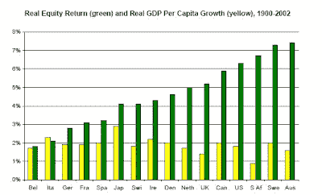

<!--yml
category: 未分类
date: 2024-05-12 20:31:19
-->

# Falkenblog: Who Gets the Equity Risk Premium?

> 来源：[http://falkenblog.blogspot.com/2012/04/who-gets-equity-risk-premium.html#0001-01-01](http://falkenblog.blogspot.com/2012/04/who-gets-equity-risk-premium.html#0001-01-01)

A big question about low volatility outperformance is why it exists. Explanations range from the nature of geometric compounding, convexity in high beta stocks, some strange manifestation of risk, or the fact that investors prefer sexy stocks for lots of reasons (principal-agent problems,  overconfidence, winners curse). Now, the latter theories are most plausible to me, but they also require something else, because if a fraction of irrational investors buy something, that only affects equilibrium prices if other rational agents are constrained in some way (or, less plausibly, that everyone is irrational). Given most investors allocated only 50% or so of their liquid wealth to stocks, I find it implausible they are constrained in their equity allocations--they can invest more directly.

My explanation is that they look at their equity holdings relatively, and this makes risk symmetric: beta=0.5 has the same risk as beta=1.5\. When this happens, deviating from the consensus is risky regardless of total volatility, because it all adds to 'tracking error'. In a sense, people are maximizing their

[Information Ratio](http://en.wikipedia.org/wiki/Information_ratio)

, not their Sharpe Ratios, and using 'the standard 60/40 equity/bond allocation' as the benchmark. If investors are doing this, it constrains the appetite for arbitrage, and so the effects of irrational preferences can exist in a rational equilibrium.

 When I first read

[Dimsom, Marsh and Staunton (2006)](http://papers.ssrn.com/sol3/papers.cfm?abstract_id=891620)

, it first occurred to me that this could solve my longstanding confusion on this point, because they basically cut the equity premium in half just by adding geometric averaging and survivorship bias, and I knew that was only a part of the adjustment menu. The relative risk theory only makes sense if the equity premium is zero, which previously was inconceivable, but after DMS cut it in half that didn't seem impossible.

Nonetheless, while the equity risk premium is down to about 3.5% these days, and realistic standard errors are about 4%, no one thinks it is zero. I asserted it was zero previously because it seemed possible, and solved many other problems (eg, the missing risk premium everywhere else). Now I'm thinking I made an error. The equity risk premium is positive, close to the 3.5% most others believe. They key is that this return is not a scalar, but rather an array. Like 'the tax rate', it isn't one thing, and the various rates make up a subtle equilibrium between various interested parties, with the returns being a function of the ignorance, impatience, and size of the investor constituency.

The efficient investor avoids active management, invests steady amounts over the business cycle, generates few taxable events, trades to minimize trade impact and the effect of a bid-ask spread. Your average investor trades inefficiently, and generates a lot of profit for a large and vibrant financial community to turn into the '

[little crumbs](http://books.google.com/books?id=u0W4zg1OzBEC&pg=PA237&lpg=PA237&dq=bonfire+of+the+vanities+crumbs&source=bl&ots=ln-iu3kixj&sig=rPfjrTMnsOixAne7nwpbpWctFx4&hl=en&sa=X&ei=bNSVT5KpFYTX0QGPsdjmBw&ved=0CDoQ6AEwAw#v=onepage&q&f=false)

' Tom Wolfe wrote about in his Bonfire of the Vanities, where all those fancy, smart suits are just middlemen, with a clear incentive to increase trading.

My claim is that the equity risk premium most people analyze does not reflect the return to an average or marginal investor, merely the non-representative efficient one. Several issues create a wedge between the raw index return one sees in index time series and the returns flowing to average investors. Thus, a modest equity premium to the indices is consistent with my overall hypothesis.

The best single statistic that illustrates this subtle equilibrium is

[Jay Ritter’s finding](http://bear.warrington.ufl.edu/Ritter/PBFJ2005.pdf)

(see above) that the cross-country correlation of real stock returns and per capita GDP growth over 1900–2002 is significantly negative. That is, cross-sectional equity returns over a hundred years are not positively related to economic growth, so it is not as if the economy is a representative firm and a risk averse individual is choosing how much wealth to allocate to a stochastic investment; rather, the stock market is a subtle game between insiders and outsiders where the insiders merely provide enough top-line returns to keep the rabble unaware they are being had.

 The Investment Company Institute

[sponsored a study](http://falkenblog.blogspot.com/2011/10/real-investors-lag-indices-by-6.html)

and found actual investors underperformed the S&P 500 for the ten-year period from December 31, 2000, through December 31, 2010, by 6 percent annually. Fund complexes and the Investment Company Institute were very loathe to present this information because it highlighted that they are severely overrepresenting investor returns by using simple indexes, ignoring the many slips between cup and lip in the investment process. Luckily for the investing community, individual investors accommodate this misrepresentation, as even highly educated investors overestimate their personal returns by this order of magnitude (i.e., 6 percent annualized return). This is probably due to simple cognitive dissonance, as investors are mentally distressed by the conflict between a good self-image and empirical evidence of poor trading tactics. To reduce the discomfort, investors adjust their memory about that evidence and those choices. This is then selectively reinforced by noticing the returns of just their good performing stocks and mutual funds in the portfolio and not the poor ones because ex-post awareness these were mistakes rather than legitimate data.

 The dramatic overestimation of typical individual returns via the benchmarks is a rather important, and unremarked, fact. The actual net returns to average investors remain something of little interest to modern research. Note that prior to the competition from electronic trading, discount brokerages, the deregulation of commissions in 1975, and the reintroduction of odd-eighths quotes on the Nasdaq in the 1990s, trading costs were certainly much higher, yet most researchers look merely at the top line of the indexes as these costs were irrelevant, and top line pre-1975 returns are the same to investors as they are subsequently. If average investors are looking at their returns after fees and taxes, these costs should be highly relevant, but instead they are routinely ignored. This highlights a very strange incuriosity with net returns to investors. Consider the following items that subtract from top line returns, independent of the issues about geometric averaging, peso problems, and survivorship bias:

1.  Taxes (see [Gannon and Blum](http://www.iijournals.com/doi/abs/10.3905/jwm.2006.644217))
2.  Adverse market timing (see [Ilia Dichev](http://www.bus.umich.edu/NewsRoom/ArticleDisplay.asp?news_id=4265))
3.  Transaction costs (nothing good, just watch your fills)

Conservative estimates to our 1900–2010 data add up to an adjustment to the effective equity risk premium that puts it at zero, as each has been estimated around 2 percent. Note that the ICI study mentioned above estimates a 6 percent annualized deficiency relative to the equity index averages—ignoring taxes. Fortunately for brokers, individual investors have bad memories, as

[Goetzmann and Peles (1997)](http://en.scientificcommons.org/51950702)

found that individuals overestimate their own investment performance by an average of 3.4 percent.

In many ways, investors are like all those people who recall their last trip to Las Vegas left them flat or up a little. The equity risk premium can be thought of as a very subtle equilibrium, where the efficient investor who makes a 3% premium is the loss-leader to equity issuers, and the average investor more than makes up for this ‘expense’ to the insiders. Though an efficient investor may be able to invest in efficient passive funds and capture much of the equity premium, such an investor is the exception in the same way that your average blackjack player loses considerably more per hand than your robot optimizer. That is, just as most hedge fund profits go to hedge fund owners, most outside equity investment goes to insiders—brokers, management, initial equity owners—via the persistent mistakes and carelessness of your average investor. Equity returns are not simply a stochastic process that a singular representative investor chooses, but rather a complex set of returns depending on the strategy and tactics used by heterogeneous investors, many of whom make conspicuously inefficient choices. The

[bookies](http://www.goldmansachs.com/)

, and the

[insiders](http://falkenblog.blogspot.com/2011/01/adverse-timing-kills-returns.html)

selling dreams, always win, and if they didn't the market would not exist as it currently does. The equity risk premium is zero for the marginal investor.