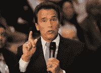

<!--yml
category: 未分类
date: 2024-05-12 22:04:38
-->

# Falkenblog: Why Democrats Tend to be More Socially Liberal

> 来源：[http://falkenblog.blogspot.com/2009/05/why-democrats-tend-to-be-more-socially.html#0001-01-01](http://falkenblog.blogspot.com/2009/05/why-democrats-tend-to-be-more-socially.html#0001-01-01)

I would say most of my friends are socially liberal and fiscally conservative. In a word, libertarians. We like the right to use guns and drugs, and have sex in any consenting adult manner we please. But we also don't like taxes, and redistribution schemes like welfare and social security. Nevertheless, the major party divide in the US are social liberals/high taxers in one party, social conservative/low taxers on the other. Why is this the default when it seems so schizophrenic?

I think Arnold Schwarzenegger gives us a hint, as he recently

[broached the idea](http://features.csmonitor.com/politics/2009/05/06/legalize-marijuana-schwarzenegger-says-lets-debate-it/)

of legalizing marijuana. This has the obvious appeal to social liberals who believe in freedom to make such decisions for ourselves. But as California is in a huge structural budget deficit and has little ability to address spending, the need for cash to sustain the Beast is the real driver. As The Terminator notes: 'I think all of those ideas of creating extra revenues, I'm always for an open debate on it.'

Before the modern personal income tax in 1913, liquor taxes accounted for about

[a third of federal revenues](http://www.fee.org/pdf/the-freeman/0801Boudreaux.pdf)

. Then came the income tax in 1914 and, on its heels, America’s entry into World War I. During the war federal revenues received through income taxation for the first time exceeded those from any other single source. By fall of 1917 Congress saw the income tax as its chief source of revenue, reducing the cost of voting for Prohibition in December 1917\.

The Great Depression severely depressed incomes and tax revenues correspondingly plunged beginning in 1931\. By 1932 federal income-tax receipts fell by well over a third from their level in 1931 and to almost half their 1930 level. Prohibition’s repeal in 1933 generated a big jump in revenues. As a percentage of federal government revenues, liquor taxes jumped from 2 percent in 1933 to 9 percent in 1934 to 13 percent in 1936\.

Big government fans need money, and income tax revenues do face a Laffer curve effect at some rate. In this context, taxing underground activities is a no-brainer for most Liberals, and so big-government types are in favor of legalizing activities that conservatives think are best kept underground. It's not a complete theory, but I think it explains some of our strange two-party idealogical cleavage.