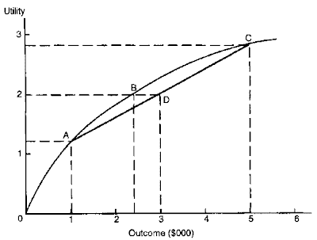

<!--yml
category: 未分类
date: 2024-05-12 21:36:45
-->

# Falkenblog: Why Envy Dominates Greed

> 来源：[http://falkenblog.blogspot.com/2010/03/why-envy-dominates-greed.html#0001-01-01](http://falkenblog.blogspot.com/2010/03/why-envy-dominates-greed.html#0001-01-01)

Economists generally think of self-interest as maximizing the present value of one’s consumption, or wealth, independent of others. Wealth can be generalized to include not just their financial assets, but the present value of their labor income and even public goods. Adam Smith emphasized a self-interest that also recognized social position and regard for society as a whole, but this was well before anyone thought of writing down a utility function, which is a mathematically precise formulation of how people define their self-interest.

But what if economists have it all wrong, that self-interest is primarily about status, and only incidentally correlated with wealth? A lot, it turns out.

In a book titled

[Human Universals](http://www.amazon.com/Human-Universals-Donald-Brown/dp/007008209X)

, professor of anthropology Donald Brown listed hundreds of human universals in an effort to emphasize the fundamental cognitive commonality between members of the human species. Some of these human universals include incest avoidance, child care, pretend play and many more. A concern for relative status is a human universal, and relative status is a nice way of saying people have envy and desire power [status seeking, benchmarking, all fall under this more sensational description, envy].

The idea that ‘incentives matter’, and that people generally act in their material self-interest, is a powerful assumption. Alternative conceptions of human action, such as that people care mainly about their community, country, or God, are considerably more convoluted in explaining, say, why stock prices are uncorrelated from one day to the next.

However, there are many anomalies to this assumption, and my big idea in this article is the standard conception of self-interest is not cynical enough: envy can explain most of what greed can, plus more. For example, a nonobvious implication of a standard formulation of self-interest--that our happiness increases in wealth, but at a decreasing rate--is a necessary and sufficient condition that a ‘risk premium’ must accompany risky assets. This was developed in the 1950s and 1960s into

[Modern Portfolio Theory](http://en.wikipedia.org/wiki/Modern_portfolio_theory)

and is a mainstay of business school curricula. Yet the data supporting this seemingly intuitive theory (‘higher risk--correctly defined--implies higher expected return’), is lacking for

[every asset class you can imagine](http://papers.ssrn.com/sol3/papers.cfm?abstract_id=1420356)

(stocks, bonds, lotteries, currencies, futures), with only a few conspicuous consistent anecdotes (ie, short-term US Treasuries and AAA bonds have low risk and low returns).

Why might this be? I wrote a

[book](http://www.amazon.com/Finding-Alpha-Search-Return-Finance/dp/0470445904/ref=sr_1_1?s=books&ie=UTF8&qid=1395095771&sr=1-1&keywords=finding+alpha)

arguing this is because if everyone is benchmarking against everyone else, not maximizing wealth but rather relative wealth, it turns out the mathematical implication is that the risk premium goes to zero (see

[The Missing Risk Premium](http://www.amazon.com/Missing-Risk-Premium-Eric-Falkenstein/dp/1470110970/ref=sr_1_1?s=books&ie=UTF8&qid=1345223074&sr=1-1)

for a terse update). It’s a rather straightforward implication, and it does involve

[a](http://papers.ssrn.com/sol3/papers.cfm?abstract_id=1420356)

little math, but the bottom line is, different assumptions generate different realities.

In the 1950s,

[Harry Markowitz](http://en.wikipedia.org/wiki/Harry_Markowitz)

discovered that regardless of how much we diversify our portfolios, risk remains because assets tend to be correlated. That is, regardless of how many stocks you own, when the market is down, all the broadly diversified portfolios are down. So there's this thing, non-diversifiable risk, often proxied by the SP500, that is the risk society must bear. However, people do not like risk. This is a direct outcome of how we model self-interest. We assume that utility (aka 'welfare') is increasing in wealth, the increase occurs at a decreasing rate. That is, given the

[graph below](http://homepage.newschool.edu/het//essays/uncert/aversion.htm)

of utility, we see the payout of A

 [or C has a mean of D. However, the utility of the certain payoff of B is the same as the average utility of A and B. Thus, you need more than the expected value of a payoff, a risk premium, to accept risk (B less than D). Those accepting this risk receive higher returns than those that do not, as an inescapable consequence of the fundamental way economists model human behavior.

**Standard Utility Function** 

While

[Modern Portfolio Theory](http://en.wikipedia.org/wiki/Modern_portfolio_theory)

, which developed the above into the Capital Asset Pricing Model, has become a staple for B-School students, one of its central empirical implications does not work: there is no premium for high-risk stocks as predicted, such as those with high covariance with the market. This standard model is still prominent because supposedly the 'true' model works just like it, if we only knew the subtle trick needed to estimate 'true' risk. The confounding results are everywhere: there is no intuitive measure of risk that predicts returns in currencies, movies, mutual funds, BBB to B rated corporate bonds, private investments. Returns when the market is volatile (eg, 2008) are not higher than when it is tranquil (eg, 2004). Idiosyncratic volatility, financial distress, analyst disagreement, equity options, IPOs, lotteries, and long odds in sportsbooks, all confound standard theory because what is intuitively risk—things with high volatility, or highly correlated with the business cycle—have similar or even

[lower returns than average](http://papers.ssrn.com/sol3/papers.cfm?abstract_id=1420356)

.

Most work finance today involves teasing out the nuance of risk that explains this null result. Like a wine expert finding they can't discern a Chateau Lafite Rothschild from Two-Buck Chuck, experts are very good at rationalizing, especially using 'powerful econometric techniques' that hide the embarrassment in obscure metrics.

I wrote a

[book](http://www.efalken.com/video/index.html)

arguing a simpler solution. As shown in the table below, X is considered riskier, with a 30 point range in payoffs versus a 10 point range for Y. Yet on a relative basis, each asset generates identical risk. In State 2, X is a +5 outperformer; in State 1, X is a -5 underperformer, and vice versa for asset Y. In relative return space, the higher absolute volatility asset is not riskier; the reader can check this for any case in which the two assets have the same mean absolute payout over the states (i.e., the average for asset X and asset Y is the same). The risk in low volatility assets is its losing ground during good times. If X and Y are the only two assets in the economy, equivalent relative risk can be achieved by taking on an undiversified bet on X or Y, which is identical to taking a position on not-Y and not-X. The positions, from a relative standpoint, are mirror images. Buying the market, in this case, allocating half of each, meanwhile, generates zero risk.

**Relative Payoffs Symmetric**

|  | total return |  | relative return |
| X | Y | avg | X | Y |
| State 1 | 0 | 10 | 5 | -5 | +5 |
| State 2 | 30 | 20 | 25 | +5 | -5 |

Everything related to risk premiums flows from this simple insight. Implicitly the utility and arbitrage equilibria derive from the fact that when relative wealth is the objective, the risk is symmetric, as the complement to any portfolio subset will necessarily have identical — though opposite signed — relative return. Thus arbitrage exits if there is a risk premium (in a relative status world). One should note that a relative wealth world is just like a world where everyone is benchmarking against others, and note that most investment managers are measured relative to a benchmark (this generates the same zero-risk premium implication if everyone is maximizing return dividing by 'residual benchmark error').

Of course, people are still risk-averse, in that they will pay to avoid having risk thrust upon them, and so buy insurance. Yet, systematic risk, the risk that presumably yields a risk premium, is distinct from that. Note that as 'risk-free' is buying whatever everyone else is buying, you have the potential for bubbles. As a sector like internet companies, or housing, becomes larger, one allocates more to it without much notice, because it isn't risky if everyone is doing it. My experience working in finance is that it is much easier to sell a new strategy if several of your competitors are already doing it, indeed, one should probably anticipate your superiors asking for good reasons why one is not doing what competitors are doing. An investment that starts off solid and gains conspicuous support can cross over into a bubble because at some point investment demand can create a positive feedback loop as more people try to emulate their peers, who then generate more benchmarks that generate more emulation.

Envy Explains a lot more than Asset Pricing

Now, you may consider this abstract or parochial, but it has other implications that make it anathema to economists. Consider

[Easterlin's Paradox](http://en.wikipedia.org/wiki/Easterlin_paradox)

, the finding that after a minimum level of income has been achieved, measured happiness does not appear to rise much. If people's happiness is a function of wealth, we are much wealthier than our ancestors but not much happier. This has been documented in many countries, such as Japan, where income rose five-fold from 1958-1987, yet people remained about as happy. This puzzle has been addressed in such books as Gregg Easterbrook's

[The Progress Paradox](http://www.amazon.com/Progress-Paradox-Better-While-People/dp/0812973038/ref=sr_1_1?ie=UTF8&s=books&qid=1263071633&sr=1-1)

, David Myer's

[The American Paradox](http://www.amazon.com/American-Paradox-Spiritual-Hunger-Plenty/dp/0300091206/ref=sr_1_2?ie=UTF8&s=books&qid=1263071663&sr=1-2)

, Barry Schwart's The

[Paradox of Choice.](http://www.amazon.com/Paradox-Choice-Why-More-Less/dp/0060005696/ref=sr_1_1?ie=UTF8&s=books&qid=1263071691&sr=1-1)

It is a paradox because it is contrary to what we think should make people happy. If people are primarily envious, this is no paradox at all. Libertarians are fond of highlighting criticisms of Easterlin’s Paradox because they can’t stand the thought that people are primarily status-seeking. This is because the assumption of simple wealth maximization has the nice property that liberty maximizes people’s wealth and thus happiness; if people are primarily status seeking, letting people alone won’t necessarily increase aggregate welfare because there will always be an underclass that is relatively poor, and unhappy.

Status seeking is all about positioning oneself in a rank. Envy is simply another way to approach the status game, noting the focus on those above. Status seeking manifests itself in many ways in common behavior. Much signaling, as when one buys conspicuous goods like a fancy watch, is about signaling status. The pleasure they generate is not a means to an end, it is an end, the feeling of having a superior status, at least for an instant. Robin Hanson, who blogs at

[OvercomingBias](http://www.overcomingbias.com/)

, often investigates things that are more about signaling than what they are putatively about: art, charity, and humor, often aren’t at all about art, charity, or humor. For example, he notes that perhaps one reason for the marked decline in fertility among developed nations is that for women, being successful at work signals higher status than being a full-time mom. Thus, many women choose to have fewer children to signal their status. This is envy because seeking status is motivated by a desire to outperform peers, as opposed to anything related solely to mere wealth. Indeed, from an evolutionary standpoint, children are the ultimate form of wealth, but if we are hardwired to outdo our peers that objective is no longer primary, but rather incidental.

Or consider Steven Pinker

[noting](http://en.wikipedia.org/wiki/The_Stuff_of_Thought)

that many aspects of speech involve protocols around dominance so that people say things like 'if you could pass the salt that would be awesome,' as a way to express a command without appearing domineering. Envy, the intrinsic hatred of being inferior, is always present and must be managed to be liked. Or consider that economist

[John List](http://www.thebigmoney.com/articles/money-trail/2009/10/27/where-superfreakonomics-falls-down)

finds that our desire to share depends on how much the other person has and how they got to their position, greatly complicating the simple self-interest. Some have highlighted this suggests a 'sharing' instinct, in part because augmenting the standard model with a preference for equality seems so nice, 'is' would be consistent with 'ought'. Alas, a lot of generosity consists of signals and quid pro quos in the context of envy. Relatively, our desire for just 'more stuff', as the standard model assumes, has no such omnipresence.

Stress isn’t caused by the deprivation of stuff so much as feeling your talents are unappreciated by your colleagues, friends, or family. An envious person wants to feel appreciated by others. This is why if you want to make someone like you, ask them a small favor. This implies you value them, that you appreciate what they can do for you. In contrast, if you offer to do something for them, they generally find your attention meddlesome and implying they are relatively incompetent. In standard economic models of self-interest, this would make little sense.

Humans are inherently social creatures, and so our greatest rewards 

*and *

problems come from other people, as opposed to 'stuff'. For economists to focus on wealth as consumption, independent of others, ignores all this.

Implications of Envy

In Helmut Schoeck's

[Envy](http://www.amazon.com/ENVY-Theory-Behaviour-HELMUT-SCHOECK/dp/0865970645/ref=sr_1_1?ie=UTF8&s=books&qid=1263072720&sr=1-1)

, he discusses the dysfunctional cultures all have an excess of undisguised envy. An extreme example is the Navaho Indians who have no concept of luck or of personal achievement and believe that one person's success can only come at another's expense. This kind of attitude effectively discourages people in such a society from adopting a better way of growing crops, etc. This may explain why James Madison insisted that

[no democracy has not committed suicide](http://economics.gmu.edu/wew/articles/fee/democracy.htm)

, is that there is a constant push to greater redistribution because nothing hits as directly at envy as progressive tax increases--which affect a minority. Functional cultures are not so defensive, and so adopt better ways even if not invented there, allowing countries like

[Japan to move quickly](http://www.grifworld.com/perryhome.html)

into modernity with all the advantages that wealth brings, by emulating a superior western technology, thus acknowledging their backwardness. What is so remarkable is how rare the Japanese strategy has been.

One must remember that the selfish behavior initially described by Adam Smith was seen as antithetical to a good society, and many argued that we are not that Machiavellian, and prioritized God, Nation, or honor. The Invisible Hand argument of Adam Smith argues the competitive equilibria of individuals acting in their own self-interest are socially desirable. Later,

[game theorists](http://en.wikipedia.org/wiki/Tit_for_tat)

and

[evolutionary biologists](http://en.wikipedia.org/wiki/Reciprocal_altruism)

showed that altruism is consistent with rational self-interest in repeated interactions (the optimal rule tit-for-tat implies being nice, provocative, and forgiving). Self-interest is morally defensible in these contexts, which is why having shareholders simply maximize share value is a counterintuitive but optimal policy in most economic models.

Is there a similar, counterintuitive silver lining to envy? There are a few things. Consider envy to be like mental depression, a state of feeling we do not like, but in moderation, keeps us from staying in a dysfunctional rut. When you are screwing up and things are not going well, you feel depressed, and hopefully, learn to change your behavior. When you are envious, hopefully, you work to relieve that feeling. How? Find something where you are relatively good, something where you can increase the amount you are respected and appreciated. You might not be a good singer or poet, but you can write code, or speak Klingon. Mickey Kaus has

[argued](http://www.amazon.com/End-Equality-Second-Mickey-Kaus/dp/0465098290/ref=sr_1_1?ie=UTF8&s=books&qid=1263072946&sr=1-1)

that one wonderful thing about modernity is the great variety of status hierarchies available to us, some vocations, many also many avocations. This highlights the advice we often give our children: try many things, find something you like. Invariably, kids like doing things they are good at, and among a large number of sports, academics, and extracurricular activities, you have a very good chance of finding something that elevates your status to tolerable levels. 

This search for our comparative advantage is a good thing for us and our neighbors. The implication that you should search for your best status hierarchy because you will enjoy it more, in turn, because other people will appreciate you more, so it is a win-win.

Compassion is another attribute that benefits from envy. Considering how wealthy we are relative to the third world, it would make no sense to feel sorry for the poor in the US. Yet, no one in America thinks the poor are doing well, because we know the unambiguously bad nature of being at the bottom, regardless of how much food and shelter goes along with it. If we didn't have envy, we could not and should not, empathize with the poor in America who generally live like the wealthy in most other times and places.

Many of today's policy debates involve, at their base, redistribution. Greg Mankiw noted health care reform would lose its impetus if it were revenue-neutral; the redistribution isn't a side benefit, it is the main point. Tax relief, or fiscal stimulus, is usually targeted at some disadvantaged group. That implies, necessarily, a subsidy from the rich. Is that really just incidental? Many times people argue for the selflessness of voting for higher taxes as if taxing a superior minority more shows your generosity. Is it fair to say good faith progressive policies are a pretext for envious redistribution? I'm sure many do not consciously believe this motivates their behavior; however, the mind is very good at rationalizing what it wants, and everyone knows the first rule of envy is not to admit it as a rationale because others do not want to work with such people. The bottom line is that if we are more envious than greedy, the desire to bring the rich down may be primary, not incidental, and all that blather about equality making for more stable or higher growth all a confabulation.

While there are some salutary effects of envy, it presents a gloomier future relative to if we are merely greedy. After 200 plus years of the Industrial Revolution, it is easy to simply assume we are going to grow at 2% GDP/capita forever, neglecting the fall of great civilizations that built the pyramids,

[Cuzco](http://www.wasai.com/machu-picchu.htm)

, or the Pantheon. Perhaps civilizations implode because they are made of people driven by envy that inevitably pulls down the talented tenth that creates everything that great societies cumulate upon in art, science, and technology. Such a scenario was scarily recounted in Amy Chua's

[World On Fire](http://www.amazon.com/World-Fire-Exporting-Democracy-Instability/dp/0385721862/ref=sr_1_1?ie=UTF8&s=books&qid=1263074743&sr=1-1)

, which noted that one commonality of genocide is the extermination of elites, who are always in the minority, and appeals to the envy, not the greed, of the masses (Jews in Germany, Kulaks by Stalin, Tutsi's in Rwanda, Armenians in Turkey, educated Cambodians by Pol Pot).

Risk Aversion’s Fragile Formulation

Economists strongly prefer the idea that people are merely wealth maximizing agents because this generates tractable models, and economists are primarily

[modelers](http://falkenblog.blogspot.com/2009/01/economists-are-modelers.html)

. Envy would invalidate many models, if not entire subdisciplines because in that case, one cannot aggregate preferences into one person, as it makes no sense to talk about the aggregate happiness of people when their happiness depends mainly on their relative positions. Economists like to add these curiosities outside models, but clearly, the objective function to maximize GDP is misleading if envy is very important. As the old can opener joke goes, economists like the assumption because it generates nice answers.

So, over the years, economists have become good at defining exactly what kind of utility allows them to generate tractable models. While some assumptions, such as assuming everyone has the same beliefs and preferences, have been attacked, they generally haven't made much of a difference. But these are rather small compared to the idea that the utility function people are maximizing has '

[constant relative risk aversion](http://www.econ.ku.dk/okombe/intmonecon/crra.pdf)

'. The idea here is that while we think it fundamental that people have utility increasing in wealth at a decreasing rate, the specific functional form is actually highly circumscribed.

The problem is, we know that the utility curve becomes come much flatter as wealth increases, implying rich people are almost indifferent to risk. It seems implausible that risk preferences for you average person have declined over the past millennium, or century, as this would be reflected in all sorts of prices like the 'risk-free rate, which has not changed considerably over the past 150 years. So, economists discovered we must have 'constant relative risk aversion' so that 'risk' is relatively the same regardless of how much wealth you have: a 10% gamble always much feels the same. If risk preferences were not of this sort, one can

[be presented](http://www.jamesrmaclean.com/mw/index.php/Constant_relative_risk_aversion)

with a series of risks where some other party—say, the casino management—can always make a profit, and essentially "pump" money out of players. While some people undoubtedly are like that, the population in the aggregate cannot be, or the economy would grind to a halt forever. The modern notion of risk aversion that does not lead to absurdity is that we value wealth via a function of the precise form x^(1-a)/(1-a) (where

**a**

is the risk aversion constant, usually 3.0 to 10.0), because only that function would imply the consistent interest rates we have seen over the past thousand years. How plausible is it that humans have this kind of mathematically precise instinct?

Economists like to argue about some parameters of this function, but as mentioned, one must be able to approximate a collective's preferences this way or we run into absurdities. Yet, even this highly restricted function has its own absurdities. Mathew Rabin won a MacArthur genius grant for

[showing](http://faculty.chicagobooth.edu/richard.thaler/research/JEPV15N1.pdf)

that one can apply the fact that concave functions to show that if one has the above utility, and one chooses to turn down a 50-50 bet to lose $10 or gain $11, one would not accept a bet to lose $100 and win an infinite amount of money. This clearly makes no sense and holds for any conception of utility where the utility of wealth declines as one gets more wealth. Most economists have responded with a shrug as if this is just an absurd extrapolation. A fatal counterexample, or trivial anomaly, always depends on one's priors. I think it highlights how rotten the core is, that it can not even handle the broad case. The specific function is even more implausible and absurd.

Assume you were the designer of a species of conscious agents: God, the program developer of avatars in a game (actually

[considered possible](http://www.nytimes.com/2007/08/14/science/14tier.html?_r=3&adxnnlx=1187089232-B3G%20zzuRmQOAyNEjTaQ3Yg&pagewanted=all&oref=slogin)

by thoughtful philosophers!), or anthropomorphize natural selection. The objective you face is to give these agents a utility function such that they are motivated to create buildings, art, and of course children by themselves based on some instinct. So, as a designer, you can add a mechanism so that people feel hungry if famished, and lustful when in the presence of mating opportunities, so they survive over generations. Yet, each of these desires has a clear governor that has a 'high' and 'low' setting, when you feel full or empty: you don't want people eating or having sex so much they ignore everything else, such as getting ready for eating and having sex tomorrow. Now consider the governor that signals the will to want more 'stuff'. The person one creates must have a specific function if we have an 'absolute utility' function. That is, say people developed a utility function x^½, which satisfies our basic intuition that self-interest is both increasing in wealth, but at a decreasing rate. Back in 1800, it worked pretty well. But now we are 10 times wealthier, so we should have much lower risk aversion if our utility were not of that

[very specific formulation](http://en.wikipedia.org/wiki/The_Stuff_of_Thought)

--something like -x^(-3)/3--such that risk means roughly the same thing then as it does now. If risk aversion today is correct, then back then you were afraid to look at your shadow if you people's utility was x^½, and interest rates would have been around 100%. Thus, our DNA needs a knife-edged utility function that seems patently absurd. One could, however, invoke the

[anthropic principle](http://en.wikipedia.org/wiki/Anthropic_principle)

and leave it at that (i.e., if it were not so, we wouldn't have enough wealth to be discussing this on the internet).

In contrast, it seems more likely our little governor simply says: be above average. As humans always lived in societies with others, benchmarks are not lacking, so this is a very feasible goal. Then, things take care of themselves. People are constantly doing more each generation because even if you are on top you have to run fast just to stay in the same place. Desire, striving, want, has no abstruse functional knife-edge, but a more reasonable feedback mechanism that does not lead to, or starts with an absurdity.

Conclusion

Envy is a much more evolutionarily plausible self-interest mechanism than greed because it is more robust.

In the end, going from greed to envy would allow us to explain the absence of risk premium, the Easterlin effect, the preoccupation with respect. These are not trivial phenomena. It would render a large swath of economics irrelevant, such as welfare economics or public choice because 'optimal' is usually defined relative to a utility function based on the 'Pareto principle', that you can only judge a society to be better than another if everyone is better off. Given one assumes some mechanism for redistribution exists, this generally results in rationalizing that maximizing income becomes the goal. However, as much as economists have treasured these exercises, they remain irrelevant to perennial policy debates. It's not as if current finance built on the standard utility premise can identify, let alone explain, the risk premiums that should be its ubiquitous consequence.

Economists agree that no reasonable risk metric predicts returns within or between any asset class, but now assert that risk, like fine wine, is very subtle. This is because we know there is a risk premium because, given our conception of utility (increasing at a decreasing rate), there must be a risk premium. Like telling the Journal of Marxist Studies that 'class' is not the best lens to view behavior, telling economists that self-interest is primarily envy, not consumption, is simply too dismissive of the foundations they find so compelling to their calling; all that human capital is tied to mastery of work that may not work, but at least currently there's hope that another tweak might turn these highly rigorous models into seminal, important work.

While we should recognize envy as a driver behind so much human behavior, we should recognize that like most of our drives, it must be disciplined. We have many innate drives for sex, food, and warmth, but realize that a good life does not make these ultimate things, and at many times we have to override our natural instincts. Virtue is all about doing what does not come effortlessly.

We should not be so naïve to believe most government policy is about making institutions safer, efficient, or fairer, as these are incidental means to an end, and that end is an envy-based redistribution. In some cases, base motives can lead to good outcomes, as when our efforts to maximize our status lead a business owner to treat customers well. However, government policies enacted out of envy have no beneficial results because it merely rearranges status based on political power and not the productivity that leads to so much progress in science, leisure, art, and health. If our base assumption that self-interest is not simply maximizing wealth, but rather, status, the future is a far less rosy place. An economists' current view of human nature implies that societal and self-interest are in sync via the invisible hand (with varying amounts of regulation), and is the source of much libertarian optimism. Would that it were true. We will be much better off navigating the future with a more accurate concept of human nature.

More practically, for how long does a theory have to not work before it is abandoned (ie, the risk-return implications of Modern Portfolio Theory)?]