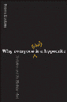

<!--yml
category: 未分类
date: 2024-05-12 20:50:22
-->

# Falkenblog: Why Everyone (else) is a Hypocrite

> 来源：[http://falkenblog.blogspot.com/2011/07/why-everyone-else-is-biased.html#0001-01-01](http://falkenblog.blogspot.com/2011/07/why-everyone-else-is-biased.html#0001-01-01)

I loved most of

[Robert Kurzban's](http://www.psych.upenn.edu/~kurzban/) [book](http://www.amazon.com/dp/0691146748)

by this title, as it's really similar to other books I liked in this genre, Geoffrey Miller's

[Spent](http://falkenblog.blogspot.com/2009/05/beware-liberal-scientists.html)

or Jonathan Haidt's The

[Happiness Hypothesis](http://falkenblog.blogspot.com/2008/07/flattering-self-portraits.html)

. It's funny and profound. Kurzban gives the nice analogy that our conscious selves are basically like the press secretary for a large organization. In such organizations, press secretaries often don't know why their organization is really doing X, indeed, they might not want to know so they can maintain plausible deniability. Further, in large organizations, there often isn't a simple reason why they are doing X, as any leader knows, even the CEO can't control very much--he's not a dictator and if he tried to be one he'd be thrown out. Yet the press secretary must spin their story as well as possible, and such is the case when we try to explain our beliefs with inconsistent explanations, or explanations that conveniently avoid certain facts and exagerate others.

There are many really interesting points made in this book. For example, he points out scenarios where more information makes us unambiguously worse off. Consider if you were watching a house burn, and saw what may or may not be a little puppy in there. You are afraid of getting hurt in the fire, so don't want to save the puppy, but you appreciate a reputation for bravery, and so don't want to be seen as avoiding your duty to save the puppy. If a little boy comes up to you and says 'Hey mister, are you going to save that puppy?' you now have to make a choice between risking your life or your reputation, because the boy now made it clear to everyone that you know the puppy is there. Damn kid. This is an example of things '

[I wish I didn't know now what I didn't know then](http://falkenblog.blogspot.com/2011/06/bob-seger-vindicated.html)

,' and why people avert their eyes from evidence contrary to their thesis. If you really dug into your opponent's arguments, you might not like what you find, so better to just attack the dopes who are against you for obviously wrong reasons, and that way you don't have to deal with greater cognitive dissonance (eg,

[John Horgan defending Stephen Jay Gould](http://falkenblog.blogspot.com/2011/07/rotational-indeterminacy-and-factor.html)

without trying to understand the criticism or even look at work subsequent to 1850 on the matter in question).

Then there's the idea that we are optimally overoptimistic, because its optimal to present yourself as successful as plausible, because that makes others like you more (they anticipate your ability to generate more favors for them in the future), making you more successful. This also makes us see our successes as more due to our efforts, and our failures more due to bad luck or evil-doers, because we will appear more sincere in our overoptimism if we truly believe it. This was nicely put into academese by

[Albert Bandura](http://webspace.ship.edu/cgboer/bandura.html)

: 'optimistic self-appraisals of capability, that are not unduly disparate from what is possible, can be advantageous, whereas veridical judgement can be self-limiting.'

Another point is that, while there are some things correlated with success like higher self esteem, merely raising your self esteem without anything else is like moving your gas gauge to Full when it's near empty, hardly an efficient solution. Feelings that are symptoms are not to be trifled with, but addressed more fundamentally.

As with many of these books, they spin out of control at the end. He also seems to think our principles are contradictory because of our mind's modularity. For example, he takes the idea that our minds are modular to explain why we both want to eat the cake, and diet, one hitting our short term pleasure, the other our long run interest to be healthy. I think this isn't modularity so much as our discount rates, and people with greater discipline forgo the quick route of indulging in leisure to get a long-term benefit. A lot of this can be explained as simply better understanding the true 'present value' of one's actions, as William James's

[pragmatism](http://serendip.brynmawr.edu/sci_cult/philsci/s03/Bastani.html)

would argue. Further, every principle is only good in moderation, as honesty clashes with politeness at some point, and so we have to always balance them. The paradox of tolerance, than an unlimited tolerance must lead to the disappearance of tolerance, requires us at times to be intolerant. It isn't due to our modular minds, just the way in which any virtue must be applied moderately and in context, as opposed to absolutely.

As he wrote a book about the essential hypocritical nature of a mind that has to explain things it can't fully understand, that mainly wants to thrive as opposed to be correct, it should come as no surprise that he ties himself into knots as a liberal who loves liberty. He argues our morality is basically a pretext for self-interested reproductive success, conditional on our current situation. So, alpha males like promiscuity, lions kill the cubs in their new prides, etc. But he notes that applying moral rules to others infringes upon their liberty and is thus bad, using the idea that '

[Rawlsian justice](http://en.wikipedia.org/wiki/A_Theory_of_Justice)

' then seems like the optimal solution. Alas, Rawlsian justice is radical egalitarian redistribution of wealth and even esteem, infringing on a lot of freedom of contract by other people merely because they happened upon having more stuff (the Rawlsian condition that forced redistribution should not hurt the least advantaged person basically makes it moot, because the least advantaged person in any society is a miserable wretch not helped nor hurt by anything). A Rawlsian utopian would equally reward, in all ways, the person who sits looking at butterflies all day and he who plays great basketball, the CEO and the janitor. This doesn't generate Sweden (prosperous and equal) rather, illiberal hell-holes like Cambodia and Russia at their worst. That Kurzban can celebrate liberty and Rawlsian justice is a nice example of the hypocrisy within us all (especially because it was not, it appears, intentional).