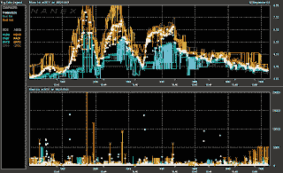

<!--yml
category: 未分类
date: 2024-05-12 20:10:10
-->

# Falkenblog: Why HFT is Not a Problem

> 来源：[http://falkenblog.blogspot.com/2013/02/why-hft-is-not-problem.html#0001-01-01](http://falkenblog.blogspot.com/2013/02/why-hft-is-not-problem.html#0001-01-01)

Many people are concerned about the fact that some people can trade more frequently than they can due to having a large infrastructure of high speed computers and connections to various exchanges.  It all seems like regular people can get ripped off, and so some kind of governor is need via transaction taxes, or some limiter on the trade frequency.

This is all unnecessary. If you are concerned about being gamed by high-frequency traders (aka HFT), there's a pretty simple way to avoid this.  Simply trade using Volume Weighted Average Price (VWAP) orders. This order gives you the volume-weighted average price for a period, usually a day, and on InteractiveBrokers it's available pretty cheaply, say for half a cent a share.  Brokers have whittled this fee pretty much down to the exchange fees and spread, taking into account the fact that they trade these things 'algorithmically', so you actually benefit from HFT as they aren't simply and stupidly crossing the market every half hour. Most HFT actually are simply common sense applied to generating a light touch by trying to emulate a market-maker (eg, posting buy orders at the bid) as opposed to something sinister.

Say you decide on Sunday, after doing all sorts of research over the weekend, that you want to buy IBM on Monday. If you are buying less than 1% of ADV, your effect on the price is positive to be sure, but spread out over the day, its too small to front run (ie, it's not sufficiently greater than the spread to be worth buying in the morning and selling at close). 

Widows and orphans can execute VWAP orders now and then benefit from any benefits in a perceived case where trading is simply done at a central auction once a day. Yet with this solution, no one is constrained, no one has to monitor or regulate anyone. The solution exists currently and is available to everyone who wants to avoid HFT.  Real investors shouldn't be day trading, but making long term decisions based on a longer-term analysis of the trends, and in that case, they can trade as if HFT didn't exist without any new rules.