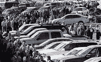

<!--yml
category: 未分类
date: 2024-05-12 21:46:39
-->

# Falkenblog: Why Health Care Reform is Doomed

> 来源：[http://falkenblog.blogspot.com/2009/10/why-health-care-reform-is-doomed.html#0001-01-01](http://falkenblog.blogspot.com/2009/10/why-health-care-reform-is-doomed.html#0001-01-01)

In 1971,

[Henry Manne](http://www.law.gmu.edu/about/history#manne)

wrote

[The Parable of the Parking Lots](http://www.nationalaffairs.com/public_interest/detail/the-parable-of-the-parking-lots)

. The lasting value of this article, along with Radford's

[Economic Organization of a POW Camp](http://www.oddgods.com/articles/2006/n24a)

, probably outweighs all that discussion of supply and demand curves that makes up so much undergraduate micro.

The story describes what happens to a college town when parking lot owners decide to get together and squelch competition. Specifically, this was targeted towards those Saturdays when football games generated an abnormal number of cars, and many people and businesses sold space on their private driveways. The parking lot owners noted horror stories about 15-year olds parking cars, or the inability to fully insure the cars! They had a meeting where they said parking cars 'wasn't a business, it was a profession', and set up a slush fund for political action. The 'unfair and dangerous competition' was made illegal, by basically mandating fixed costs that made it uneconomic for small providers of parking spaces to operate. The new law allowed the parking lot owners to increases prices under the pretext of quality, yet the result was more congestion because the parking lot owners were not equipped, or incented, to deal with the new volume efficiently. Quality was merely redefined to mean fully licensed and bonded parking lots. Creative people got around the prohibitions by offering people $5 'car washes' on their driveways that lasted several hours, which then provoked new regulation. Each new regulation created a new problem, which then motivated more regulation.

The parable supports the principle that 'quality oriented' guild monopolies conspire with legislators under the banner of 'the public interest'. They then can raise their prices by outlawing all sorts of competition. The unanticipated inefficiencies created simply raise the cry for more regulation. The net result is worse for everyone except a few parking lot owners and the legislators they support. The analogy to our current health care system is pretty straightforward, such as when only doctors are allowed to perform certain functions that a physicians assistant or nurse could easily do. But for health care it is actually much worse, because at least with parking lots customers paid directly for their services; in health care we have people spending other people's money on other people, often indirectly via mandates that people would never pay for themselves.

The market is a complex system. It is not merely a means to an end, but often an end in itself, the name we give to how we go about much of our lives providing and procuring services. When we restrict the market, it invariably makes us worse off because prohibiting two people from a subjectively mutually beneficial transaction makes them better off only under extremely rare situations (the problem of asymmetric information and non-aligned incentives is only amplified in a bureaucratic government alternative).

The US health care system involves a myriad of regulations, rights, and tort liabilities, that conspire to make this market highly perverse. Any current health care provider is already playing the game, thus, doctors in the US

[average a salary of $150k/year](http://economix.blogs.nytimes.com/2009/07/15/how-much-do-doctors-in-other-countries-make/)

, almost double that in other developed countries. Unions are

[growing in health care](http://www.weeklystandard.com/Content/Public/Articles/000/000/017/031citja.asp?pg=2)

, with the common result of inflexible rules, high salaries, and an inability to fire workers. As with our education monopoly, expect the health care professionals to make out best in any solution (Michelle Obama, after all, was a $317k/year 'diversity outreach coordinator' for the University of Chicago Hospitals once her husband became a senator--we need more of those!).

The current modifications are just like the parking lot parable: more patches for problems created by prior patches. One law government obeys is the The Second Law of Thermodynamics, so the new system will certainly be more complex. Spending more money will not make it better, just create new inalienable rights and patronage jobs paid for via the magic of deficit spending. Some day the spigot will turn off (eg, Chinese investors), the Laffer curve will constrain tax increases, the demographics will no longer have several wage earners for each person on the dole, and all these off-balance sheet liabilities will be too expensive. Then things will really get interesting.

I hope to live in a gated community by then. With a moat.