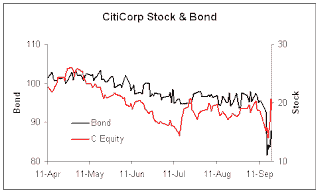

<!--yml
category: 未分类
date: 2024-05-12 22:56:39
-->

# Falkenblog: Why Last Week Was a Panic

> 来源：[http://falkenblog.blogspot.com/2008/09/why-last-week-was-panic.html#0001-01-01](http://falkenblog.blogspot.com/2008/09/why-last-week-was-panic.html#0001-01-01)

Lots of talk about how Paulson and Bernanke got a bunch of legislators together, and told them about how terrible things were. He actually got them to put aside partisanship for a little while, which basically means, he scared them shitless. The scene was described as

[this](http://www.nytimes.com/2008/09/20/washington/19cnd-cong.html?_r=3&hp=&adxnnl=1&oref=slogin&pagewanted=print&adxnnlx=1221924848-cx+IUR9a7CB9Ai5x8JHHyQ&oref=slogin)

:

> Mr. Bernanke and Treasury Secretary Henry M. Paulson Jr. had made an urgent and unusual evening visit to Capitol Hill, and they were gathered around a conference table in the offices of House Speaker Nancy Pelosi.
> 
> “When you listened to him describe it you gulped," said Senator Charles E. Schumer, Democrat of New York.
> 
> As Senator Christopher J. Dodd, Democrat of Connecticut and chairman of the Banking, Housing and Urban Affairs Committee, put it Friday morning on the ABC program “Good Morning America,” the congressional leaders were told “that we’re literally maybe days away from a complete meltdown of our financial system, with all the implications here at home and globally.”
> 
> Mr. Schumer added, “History was sort of hanging over it, like this was a moment.”
> 
> When Mr. Schumer described the meeting as “somber,” Mr. Dodd cut in. “Somber doesn’t begin to justify the words,” he said. “We have never heard language like this.”
> 
> “What you heard last evening,” he added, “is one of those rare moments, certainly rare in my experience here, is Democrats and Republicans deciding we need to work together quickly.”

Now, looking at merely equities, this was not obvious, but you can see it in the bonds, where last week they fell of a cliff for our best financial companies. The sky was falling, because if the big AA companies can't get credit, no one can, and without credit, everything stops. CitiGroups bonds dropped from a price of 92 on Monday, to 81 an Tuesday. This why there was panic at the Treasury and the Fed.

Note also that bonds for Citi, an erstwhile AA company, traded in junk territory, which means, they started trading on price, not a spread. So, any good bond dealer is hedging his long bond positions with shorts on the equity once it traded below 90, but then, bam, shorting is declared 'illegal'! Ouch. The stock rallied hard, while bonds rallied but not so much. I would say, short the stock, buy the bonds, but you can't short the stock, so I guess you have to buy puts. But puts have really high implied vols: the 10 strike puts of Dec 08 have implied vols of 122! Current at the money vols are around 70\. Now, historically their vol is around 20, so you are paying panic prices.