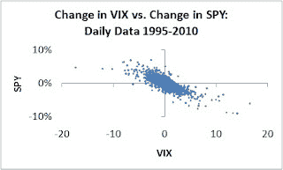
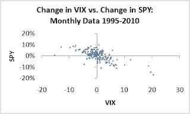

<!--yml
category: 未分类
date: 2024-05-12 21:19:40
-->

# Falkenblog: Why Volatility Innovation Can't Save the Risk Premium

> 来源：[http://falkenblog.blogspot.com/2010/10/why-volatility-innovation-cant-save.html#0001-01-01](http://falkenblog.blogspot.com/2010/10/why-volatility-innovation-cant-save.html#0001-01-01)

I

[noted that a paper](http://falkenblog.blogspot.com/2010/10/never-trust-experts.html)

referenced the fact that an asset's correlation with volatility changes is a priced risk factor. Thus, instead of the CAPM, where you have

E(R

[i]

)=R

[i]

+E*Beta*(R

[m]

-R

[f]

)

You have

E(R

[i]

)=R

[f]

+E*Beta*(ShortVolatilityInnovation)

In the 'volatility innovation' story of risk, you are worried about not some market return proxy, but rather some volatility index. We all wish we had assets that appreciated when markets go crazy, like in 2001 or 2008, but we would have to pay a premium for that, which is why (supposedly) there's a market premium for it.

Research on option strategies tend to find that selling volatility does make more of a premium than buying volatility. There are large transaction costs to this direct strategy, especially historically, so it is not clear how economically meaningful this all is in terms of a realizable premium to selling volatility. See

[Sophie Ni (2008)](http://papers.ssrn.com/sol3/papers.cfm?abstract_id=1259703)

,

[Bonderanko (2003)](http://papers.ssrn.com/sol3/papers.cfm?abstract_id=375784)

, or

[Shumway and Coval (2000)](http://papers.ssrn.com/sol3/papers.cfm?abstract_id=189840)

, for data on the returns from selling volatility (all w/o good data on transaction costs). The VIX index is derived from 30 day implied volatilities on the SPX index. Since 1995 the average has been 21.5, whereas realized vol was 20.3\. Thus, it seems you could have made money 1 vol selling at-the-money volatility.

Note this is the 'selling Black Swans' strategy, or Victor Niederhoffer as opposed to Nassim Taleb. As we know from

[Niederhoffer's record](http://seekingalpha.com/article/49251-the-third-fall-of-victor-niederhoffer)

, this strategy can be dangerous, with fat tails wiping out years of returns, so it might not be a good strategy everything considered. I have backtested such strategies using historical option data and find that over time selling vol makes a decent profit. Just good luck telling your investors that after events like in 1987, 2001, or 2008, when you get crushed.

[One paper argues](http://papers.ssrn.com/sol3/papers.cfm?abstract_id=1340575)

that 'jump risk' underlies the premium to selling volatility, and that makes sense, in that, you simply can't sell volatility as easily as buy, because of the capital requirements, so, return per underlying might look different, but on capital required via the market, not so different.

The problem with volatility correlations saving the risk premium story is that it is highly correlated with the market. Here is a daily return scatterplot:

and a monthly:

If sensitivity to volatility innovations captures the risk premium, then the flat (at best!) return to standard CAPM beta implies there must be some risk factor that offsets the negative correlation between volatility and the market. Whatever that could be makes absolutely no sense. That is, it probably had good returns in the October 1987, Sep 2001, and October 2008, yet still a positive average return. I'm open to suggestions, but this sounds the

[Flying Spaghetti Factor](http://www.venganza.org/)

.

Note that a sign of an unsuccessful theory is that as the data become more clear, and more numerous, the theory becomes less clear. First, risk was the covariance with the stock market, but ever since then it has become more nuanced, and there's always a new proxy for the risk premium(s) that 'powerful new econometric techniques' are supposed to uncover.