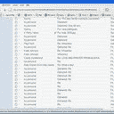

<!--yml
category: 未分类
date: 2024-05-12 22:57:34
-->

# Falkenblog: Why We Don't Have Better Politicians

> 来源：[http://falkenblog.blogspot.com/2008/09/why-we-dont-have-better-politicians.html#0001-01-01](http://falkenblog.blogspot.com/2008/09/why-we-dont-have-better-politicians.html#0001-01-01)

I don't want my kid to grow up to be President. Politicians generally are followers, not leaders, and have opinions that went not engaged in partisanship, patronizing interest groups, are generally vacuous and unoffensive ('I'm for working families'). But also, they are squeaky clean. Michael Bloomberg, in an interview before being elected mayor of New York, was asked whether he had taken marijuana. "You bet I did. And I enjoyed it," he answered. No Presidency for him.

I send and receive many emails a day. Many of these contain statements I would not want my late mother to read. Many of them make statements I would not want my neighbors to know, because an explanation of the context would seem special pleading. Some are snarky comments on friends I generally like, but can't resist a special barb with another. 'If all men knew what each said of the other, there would not be four friends in the world' said Pascal.

If you want stress, have all your emails for the past several years revealed to someone with bad faith. They will cherry pick what they find most appalling, most obscene, and point out the obvious nefarious conclusions. Defending the comments just makes you look more guilty. It's a violation of privacy of the first order. Some group based loosely around the message board 4Chan, got a hold of the password to another Palin email account: gov.palin@yahoo.com. Someone reset the password and tried to alert Sarah. But he also posted the new password, causing multiple people to try to log in at once, freezing the account for 24 hours. And now, the account has been deleted. But some emails are now out there.

The folks over at

[Gawker](http://gawker.com/5051193/sarah-palins-personal-email-account-hacked)

note this breach of privacy, and claim this maybe destruction of evidence. They also ask, 'if anyone finds evidence of saved emails, let us know.' Mother Jones

[thinks it is great,](http://www.motherjones.com/mojoblog/archives/2008/09/9765_breaking_sarah.html)

under the banner 'smart, fearless, journalism'. Huffington Posts

[highlights](http://www.huffingtonpost.com/erik-ose/sarah-palins-yahoo-e-mail_b_127177.html)

this suggests dirty dealing by the governor (what possible could a public official want to speak about privately?).

[Glenn Greenwald](http://www.salon.com/opinion/greenwald/2008/09/18/privacy/)

thinks it implies criminality. Now, these are the same people who consider the government's ability to listen in on some conversations as the ultimate violation of privacy, even though in those cases, the evidence can only be used for highly specified ends, and the intrusions are highly regulated, even if the original search is made without a hearing from a judge. This is just a fishing expedition for enemies. If you think only the government, and not litigious, or bad faith private enemies, can bankrupt you and prevent you from working, think again.

Richard Posner states that people desire privacy is for two reasons, embarrassment (of things like being seen naked) and to hide crimes. I can think of another. If someone is given enough leeway in defining what they are looking for--defining the crime--and has sufficient bad faith, they will take snippets of one's work and present it in an incriminating way, so that a judge, or the public, thinks you are guilty. Think of Ken Starr on a fishing expedition that went from a land deal in Arkansas, to sex with an intern. Of course, by the time he found that 'crime', he had a principle,

viz

, lying under oath. That it was about an infidelity did not matter, there was a principle at stake (yeah, the principle of partisanship). That you are innocent does not diminish the damages, because there are costs to defending yourself, and many people don't want to hear about the explanation, especially if it involves several sentences. Your joke about the nuns? That's just gross.

This is why you should never discuss anything really secret, or nasty, in email. It is also why my email, and computer, are routinely scrubbed with digital bleach, when not incinerated (really). This is also why politicians are generally not the kind of people I want to drink a beer with: they are usually so boring their private correspondence is dull, filled with platitudes and exclamation marks.