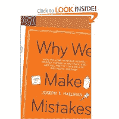

<!--yml
category: 未分类
date: 2024-05-12 22:17:32
-->

# Falkenblog: Why We Make Mistakes

> 来源：[http://falkenblog.blogspot.com/2009/03/why-we-make-mistakes.html#0001-01-01](http://falkenblog.blogspot.com/2009/03/why-we-make-mistakes.html#0001-01-01)

There are many books on 'behavioral economics', but

[Why We Make Mistakes](http://www.amazon.com/exec/obidos/ASIN/0767928059/bookstorenow96-20)

by a journalist is a pretty good summary. Indeed, I was looking at Ariely's Predictably Irrational, and found this book much more succinct. Fun facts from the book:

*   There is a 1 in 1 million chance of finding a gun in an airport check
*   people don't remember names, as opposed to the jobs or families of a person
*   80% of calls to a corporate help desk are for lost passwords
*   Simply changing pill colors from white to red and black makes them more distinctive
*   People recall their specific grades in school with an upward bias
*   Men report a median of 7 sex partners, women 4
*   84% of doctors thought others were biased by self interest, whereas only 16% thought they were biased by self interest
*   The most common airplane accident is 'controlled flight into terrain', or flying a plane into the ground
*   When asked to pick a movie viewed later, more choose highbrow movies; choosing movies now we choose lowbrow movies
*   being first on the ballot adds about 3% to a candidates vote
*   As something becomes familiar, the more we tend to notice it less
*   We see things not as they are, but as they ought to be.
*   Experts make mistakes expecting patterns that aren't there.
*   Depressed people are realists, happy people are overconfident
*   People learn more from summaries than from reading entire chapters
*   A horse race handicapper does as well with 5 bits of information as having 10, 20, or 40, though his confidence increases with the number of information bits available
*   Hope impedes adaptation. Someone with a potentially reversible colonostemy is more unhappy after 1 year than someone with a 1 year irreversible colonostemy.
*   When you are trying to make judgments about complex systems, things that are easily observed are overweighted.
*   Money does not improve efficiency of large organizations (ie, giving everyone more money).
*   Money does increase the ability of individuals to withstand discomfort in tests.