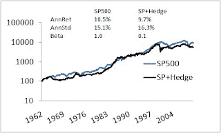

<!--yml
category: 未分类
date: 2024-05-12 21:15:41
-->

# Falkenblog: Why the Equity Premium Isn't A Risk Premium

> 来源：[http://falkenblog.blogspot.com/2010/11/why-equity-premium-isnt-risk-premium.html#0001-01-01](http://falkenblog.blogspot.com/2010/11/why-equity-premium-isnt-risk-premium.html#0001-01-01)

As I've said, there's a new consensus forming that while risk premia do not exist within asset classes they do exist across assets, with the signature example of cash, bonds, and equities. Yet, the premium dfrom cash to bonds is more like a cash premium, easily explained by the transaction benefits of cash, as opposed to any 'risk premium' in bonds. After all, you can pay for most things in cash, and that property is worth something. The equity premium of stocks over bonds, however, has for decades seemed like obvious proof of 'the risk premium'.

Yet, the equity premium for your average rube is

[hardly what the indices suggest](http://falkenblog.blogspot.com/2009/07/is-equity-risk-premium-actually-zero.html)

, because taxes, transaction costs, adverse timing all make your average return much less than the S&P500\. But even without that, consider what the equity return premium is. It should be a payment for risk, where risk is a covariance with something that proxies the happiness of investors.

If you look at the portfolio constructed by going long a beta 0.5 stocks, and short beta 1.5 stocks, the beta of that portfolio is about -1.0 (find such portfolios

[here](http://www.betaarbitrage.com/)

). This is a costless portfolio, and its annual return of around -1% annually seems insanely cheap insurance. Basically for this modest fee, you can add it to the S&P500 and presto! Beta for your equity investing is now basically zero for only a 1% a year! Most of the 'Equity Premium' can be captured by adding this costless -1 beta hedge to the S&P500.

If the S&P500 premium is due to 'risk', the risk factor is orthogonal to the S&P500 itself. What risk factor would this be? The fact that it can only exist as a subtle and obscure latent factor makes it inconsistent because it is also so vivid it generates a ubiquitous and omnipresent price impact. It's not as absurd as a theory based on wanting to kill your father and have sex with your mother, but it's up there.