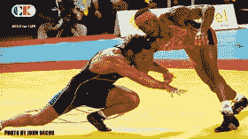

<!--yml
category: 未分类
date: 2024-05-12 20:24:29
-->

# Falkenblog: Wrestling Starts Friday!

> 来源：[http://falkenblog.blogspot.com/2012/08/wrestling-starts-friday.html#0001-01-01](http://falkenblog.blogspot.com/2012/08/wrestling-starts-friday.html#0001-01-01)

That is, men's freestyle.  Greco-Roman wrestling I find too subtle, witness Iran's heavyweight  

[defeating](http://www.nbcolympics.com/video/wrestling/wrestling-greco-roman-96kg-gold-medal-match.html)

 a Russian on a pretty weak move (a push out where he started on top). It's just a very strange way to wrestle, and the US got shut out to boot. Note America's best wrestlers (eg, Dan Gable, John Smith, Cael Sanderson) have all wrestled freestyle, because that is more like the American collegiate style.

 And don't get me started on women's wrestling, which I think is fine except it often gets equal space in big media outlets like Sports Illustrated or NBC, even though there are about 200 times as many male wrestlers or female soccer players per female wrestler, making the best women wrestlers not very elite relative to male wrestlers or your average female athlete.

Friday has the 55 and 74 kg divisions, Saturday the 60, 84 and 120 kg, and Sunday the 66 and 96 kg. The USA's best chance is 74 kg Jordan Burroughs at 13/8 odds, then 84 kg Jake Herbert and 120 kg Tervel Dlagnev at 8/1\. (got the odds

[here](http://www.flowrestling.org/article/13802-London-Betting-Odds?ref=ouremailbetthefarmonburroughs)

). A weight class goes to completion in one day.

 I think Burroughs has raised Herbert's game, and really hope he can win because Herbert's a very personable guy who would be a good ambassador for the sport. Burroughs has been awesome lately, but everyone is good at that level (Denis Tsargush of Russia and Sadegh Goudarzi of Iran both could win).

 Michael Novogratz of Fortress

[helped raise some money](http://www.bloomberg.com/news/2012-07-26/novogratz-wrestles-wall-street-for-funds-to-lure-u-s-olympians.html)

, so American wrestlers will get $250k, $50k, and $25k for Gold, Silver, and Bronze medals.

update: Burroughs wins gold at 74kg.  Some Russian guy wins at 55kg.