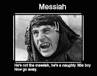

<!--yml
category: 未分类
date: 2024-05-12 22:49:55
-->

# Falkenblog: Yea, I Voted

> 来源：[http://falkenblog.blogspot.com/2008/11/yea-i-voted.html#0001-01-01](http://falkenblog.blogspot.com/2008/11/yea-i-voted.html#0001-01-01)

For most people, a great candidate is someone who articulates their personal major policy preferences successfully (it's funny how many truly smart Democrats observe that Bill Clinton is 'really smart' after meeting him; they mean to say, he's powerful and I agree with him). I consider a candidate great if I suspect they vote for things as I would after investing a great deal of time evaluating the proposal. That is, they have my preferences and vision as to how the world works, but are much more knowledgeable about various facts. This may seem self-centered, but my preferences and world-view are based on my best guess on the truth, taking into consideration all that I know, including the arguments of those I disagree with. I don't see many candidates like that, so I just had fun, wondering how many people knew anything about the 40 judges and Water Commissioner we were voting on. I voted for the Constitution Party for President, because I didn't know anything about them, but I'm definitely not anti-Constitution.

As I have noted

[before](http://falkenblog.blogspot.com/2008/10/why-leaders-arent-smart.html)

, leaders are paradoxically not our 'best and brightest'. They are slightly-above-average people with a patience for protocol and process, who offend the least but are not stupid. In school I remember many groups talking about the excellence of leaders, about how to train leaders, and select them, as if they were like candidates for the Apollo program where you have all these 'best of the best' filters. In contrast, politicians, especially successful ones (eg, read Caro's biography of Lyndon Johnson) are smarmy, insincere, flattering nabobs, the kind of people who adopt a southern accent when campaigning in the south, who speak with great conviction about meaningless platitudes ('I'm for children/change/peace'). I'm more impressed by the character and intelligence of the head of accounts receivable for a mid-sized company, or an assistant high-school football coach.