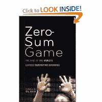

<!--yml
category: 未分类
date: 2024-05-12 20:42:38
-->

# Falkenblog: Zero-Sum Game

> 来源：[http://falkenblog.blogspot.com/2011/10/zero-sum-game.html#0001-01-01](http://falkenblog.blogspot.com/2011/10/zero-sum-game.html#0001-01-01)

A while back I got a copy of

[Zero-Sum Game](http://www.amazon.com/Zero-Sum-Game-Largest-Derivatives-Exchange/dp/0470624205)

by Erika Olson. She worked for the CBOT when there was a merger battle with CME and the ICE exchanges, so it's basically a lot of inside baseball on the corporate politics of acquisitions. It sat on my bookshelf hidden for a while, because it didn't really leap up at me. But eventually I found time to read it, and it reminded me of the old saw that everyone has a story to tell.

What's most telling is that any large institutional realignment involves a lot of little issues, and various stakeholders all have different interests and power, and making them all happy involves a lot of politics that is difficult to do publicly. The idea that merely passing a law will change things is pretty naive because any explicit, complicated process invites its circumvention. You need to align incentives, and in the private market this is by giving various people carefully delineated property rights (shares, seats), often via having them buy-in explicitly in some way. When you involve 'stakeholders' who don't have any investment in the process, they just have some vague sense of a better structure, these people just create more anachronisms and complexities that lower transparency and help insiders.

One of the more telling anecdotes was about how when Amaranth Advisers was still alive, it was breaking various position limits in energy on the NYMEX, and the CFTC which regulates the NYMEX took 7 months to actually enforce these rules. Yet Amaranth merely moved its positions to another exchange, the ICE, whose natural gas swaps were not subject to position limits at that time. One should anticipate that any regulation that mandates certain positions must be in a certain contract on a particular set of exchanges, will simply move to highly correlated positions in different venues.