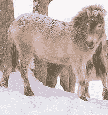

<!--yml
category: 未分类
date: 2024-05-12 23:18:28
-->

# Falkenblog: Zoo with Horses

> 来源：[http://falkenblog.blogspot.com/2008/05/zoo-with-horses.html#0001-01-01](http://falkenblog.blogspot.com/2008/05/zoo-with-horses.html#0001-01-01)

So we went to the zoo today, and I guess because it's cold in Minnesota (like Moscow), the zoos here are not so good. No lions, alligators, elephants, hippos. Instead, lots of ungulates, which simply are not the world's coolest animals. Whatever, zoos are for kids. But then we get to the '

[Wild Horses](http://www.mnzoo.com/animals/northern_trail/phorse_1.asp)

' exhibit, and I just think it's lame. What's next, cats and dogs? I ask the Zoo Volunteer, what is the difference between these horses, and ones in barns across the US? The answer: 'these are

wild

'. OK. The 'wild horses' look just like regular horses, only a little scruffier. I get the sense it's one of those Hans Christian Andersen stories.