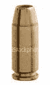

<!--yml
category: 未分类
date: 2024-05-12 23:03:06
-->

# Falkenblog: hollow point bullets

> 来源：[http://falkenblog.blogspot.com/2008/08/hollow-point-bullets.html#0001-01-01](http://falkenblog.blogspot.com/2008/08/hollow-point-bullets.html#0001-01-01)

I'm hanging out with a fellow parent at some kid thing, talking to an ex-army guy. He tells me that hollow point bullets are illegal via some convention. That is, these bullets generate so much damage in the body, they are immoral, and so illegal (whatever that means in international law). Whenever you shoot at someone, in theory, you are OK with killing them. So instead of hollow point bullets, we just have bigger caliber bullets? Do these people understand that bullets kill people, and getting rid of hollow points just invites compensating adjustments?

It reminds me a little of the torture debate. Torture is never acceptable to many people, because it makes us no better than 'them'. But, even the biggest lefty recognizes the right to use lethal force in certain circumstances, which is why our armed services and police have guns with bullets. Clearly, killing is one thing, but torture is much much worse, though I would much rather my children be tortured than murdered. It's all about being able to rationalize one's moral supremacy. I think such people need to understand that arsonists and firefighters deal with fire, and they are very different people.