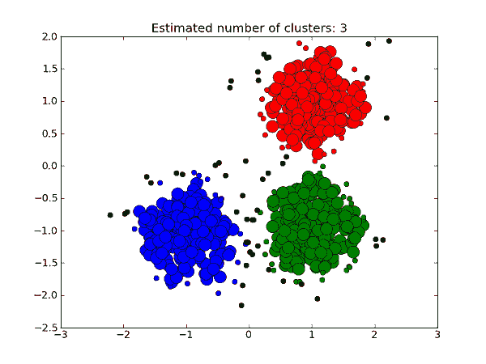
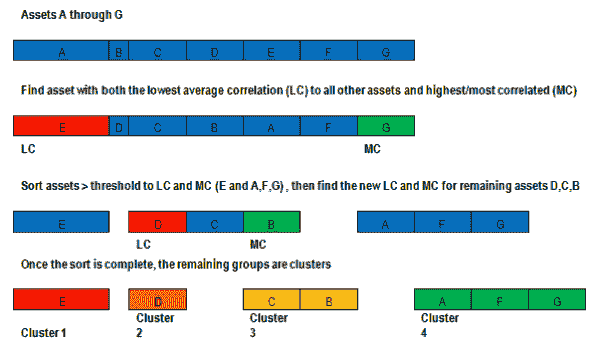
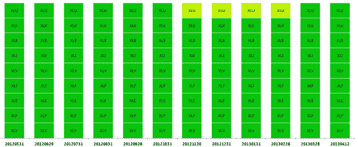

<!--yml
category: 未分类
date: 2024-05-12 17:56:25
-->

# Fast Threshold Clustering Algorithm (FTCA) | CSSA

> 来源：[https://cssanalytics.wordpress.com/2013/11/26/fast-threshold-clustering-algorithm-ftca/#0001-01-01](https://cssanalytics.wordpress.com/2013/11/26/fast-threshold-clustering-algorithm-ftca/#0001-01-01)

Often it can be surprisingly difficult to improve upon a simple and time-tested recipe. During  the summer of 2011, I worked with [Corey Rittenhouse](http://catallacticanalysis.com/) to develop algorithms for grouping asset classes. At the time, I did not have any familiarity with “clustering” algorithms that are often used in  data mining research. The first algorithm that was created resulted from a desire to simplify the complex problem of grouping assets with very few steps, and also to make it computationally simple. As it turns out, ignorance was bliss. The **Fast Threshold Clustering Algorithm** **(FTCA)** has many desirable properties that traditional clustering algorithms do not: 1) it produces fairly stable clusters 2) it is fast and deterministic 3) it is easy to understand.  When [Michael Kapler](http://systematicinvestor.wordpress.com/) and I conducted cluster research for our [Cluster Risk Parity](http://www.systematicportfolio.com/rfinance2013) portfolio allocation approach with modern clustering methods, one of the biggest issues we both saw was that the resulting clusters changed too frequently– creating excessive turnover. Furthermore, highly correlated datasets such as the Dow 30, had more clusters than logic or rationale would tend to dictate. This  results from the fact that most cluster algorithms function like an optimization routine that seeks to maximize inter-cluster dissimilarity and intra-cluster similarity. This can mean that clusters will change because of very small changes in the correlation matrix that are more likely to be a function of noise. Threshold clustering by comparison uses a logical correlation threshold to proxy “similar” versus “dissimilar.” In FTCA, I initially used a correlation threshold of .5 (approximately the level of statistical significance) to separate similar from dissimilar assets.  The FTCA works similar to the [Minimum Correlation Algorithm](https://cssanalytics.wordpress.com/2012/09/21/minimum-correlation-algorithm-paper-release/ "Minimum Correlation Algorithm Paper Release") in that it uses the average correlation of each asset to all other assets as a means of determining how closely or distantly related an asset is to the universe of assets chosen. A graphic of how the FTCA creates clusters is presented below:

The pseudocode for FTCA is presented below:

***While there are assets that have not been assigned to a cluster***

*   **If only one asset remaining then**
    *   **Add a new cluster**
    *   **Only member is the remaining asset**
*   **Else**
    *   **Find the asset with the Highest Average Correlation (HC) to all assets not yet been assigned to a Cluster**
    *   **Find the asset with the Lowest Average Correlation (LC) to all assets not yet assigned to a Cluster**
    *   **If Correlation between HC and LC > Threshold**
        *   **Add a new Cluster made of HC and LC**
        *   **Add to Cluster all other assets that have yet been assigned to a Cluster and  have an Average Correlation to HC and LC > Threshold**
    *   **Else**
        *   **Add a Cluster made of HC**
            *   **Add to Cluster all other assets that have yet been assigned to a Cluster and have a Correlation to HC > Threshold**
        *   **Add a Cluster made of LC**
            *   **Add to Cluster all other assets that have yet been assigned to a Cluster and have Correlation to LC > Threshold**
    *   **End if**
*   **End if**

***End While***

It is interesting to look at the historical clusters using FTCA with a threshold of .5 on previously used datasets such as the 8 major liquid ETFs (GLD,TLT,SPY,IWM,QQQ,EFA,EEM,IYR), and the 9 sector Spyders (S&P500 sectors: XLP,XLV,XLU,XLK,XLI,XLE,XLB,XLY,XLF). The database was updated until May of 2013 and shows the historical allocations/last 12 months of clusters generated using a 252-day lookback for correlation with monthly rebalancing. First the 8 major liquid ETFs:

Notice that the clusters are very logical and do not change once within the 12 month period. The clusters essentially represent Gold, Bonds and Equities (note that a 60 month period shows very little change as well). Now lets take a look at the clusters generated on the famously noisy S&P500 sectors:

Again, the last 12 months of clustering shows very little change in cluster membership. Most of the time, the sectors are intuitively considered to be one cluster, while occasionally the utilities sector shows a lack of correlation to the rest of the group. The choice of threshold will change the number and stability of the clusters- with higher thresholds showing more clusters and a greater change in membership than lower thresholds. As much as I have learned about very sophisticated clustering methods in the last year, I often am drawn back to the simplicity and practicality of FTCA.  From a portfolio management standpoint, it makes using clusters far more practical as well for tactical asset allocation or implementing cluster risk parity.