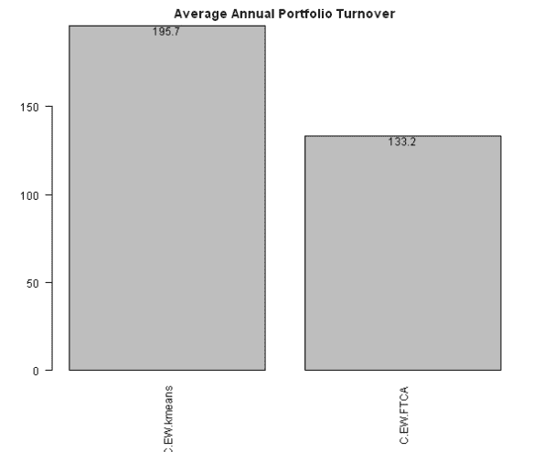

<!--yml
category: 未分类
date: 2024-05-18 14:31:20
-->

# Fast Threshold Clustering Algorithm (FTCA) test | Systematic Investor

> 来源：[https://systematicinvestor.wordpress.com/2013/11/28/fast-threshold-clustering-algorithm-ftca-test/#0001-01-01](https://systematicinvestor.wordpress.com/2013/11/28/fast-threshold-clustering-algorithm-ftca-test/#0001-01-01)

Today I want to share the test and implementation for the [Fast Threshold Clustering Algorithm (FTCA)](http://cssanalytics.wordpress.com/2013/11/26/fast-threshold-clustering-algorithm-ftca/) created by David Varadi. This implementation was developed and contributed by Pierre Chretien, I only made minor updates.

Let’s first replicate the results from the [Fast Threshold Clustering Algorithm (FTCA)](http://cssanalytics.wordpress.com/2013/11/26/fast-threshold-clustering-algorithm-ftca/) post:

```

###############################################################################
# Load Systematic Investor Toolbox (SIT)
# https://systematicinvestor.wordpress.com/systematic-investor-toolbox/
###############################################################################
setInternet2(TRUE)
con = gzcon(url('http://www.systematicportfolio.com/sit.gz', 'rb'))
    source(con)
close(con)

	#*****************************************************************
	# Load historical data for ETFs
	#****************************************************************** 
	load.packages('quantmod')

	tickers = spl('XLY,XLP,XLE,XLF,XLV,XLI,XLB,XLK,XLU')

	data <- new.env()
	getSymbols(tickers, src = 'yahoo', from = '1900-01-01', env = data, auto.assign = T)
		for(i in ls(data)) data[[i]] = adjustOHLC(data[[i]], use.Adjusted=T)		
	bt.prep(data, align='keep.all')

	#*****************************************************************
	# Helper function to compute portfolio allocation additional stats
	#****************************************************************** 
	portfolio.allocation.custom.stats.clusters <- function(x,ia) {
		return(list(
			clusters.FTCA = cluster.group.FTCA(0.5)(ia)			
		))
	}

	#*****************************************************************
	# Find clusters
	#****************************************************************** 		
	periodicity = 'months'
	lookback.len = 252

	obj = portfolio.allocation.helper(data$prices, 
		periodicity = periodicity, lookback.len = lookback.len,
		min.risk.fns = list(EW=equal.weight.portfolio),
		custom.stats.fn = portfolio.allocation.custom.stats.clusters
	) 			

	clusters = obj$clusters.FTCA$EW	
	clusters['2012:05::']

```

The clusters are stable and match David’s results

```

           XLB XLE XLF XLI XLK XLP XLU XLV XLY
2012-05-31   1   1   1   1   1   1   1   1   1
2012-06-29   1   1   1   1   1   1   1   1   1
2012-07-31   1   1   1   1   1   1   1   1   1
2012-08-31   1   1   1   1   1   1   1   1   1
2012-09-28   1   1   1   1   1   1   1   1   1
2012-10-31   1   1   1   1   1   1   1   1   1
2012-11-30   2   2   2   2   2   2   1   2   2
2012-12-31   2   2   2   2   2   2   1   2   2
2013-01-31   2   2   2   2   2   2   1   2   2
2013-02-28   1   1   1   1   1   1   1   1   1
2013-03-28   1   1   1   1   1   1   1   1   1
2013-04-30   1   1   1   1   1   1   1   1   1
2013-05-31   1   1   1   1   1   1   1   1   1
2013-06-28   1   1   1   1   1   1   1   1   1
2013-07-31   1   1   1   1   1   1   1   1   1
2013-08-30   1   1   1   1   1   1   1   1   1
2013-09-30   1   1   1   1   1   1   1   1   1
2013-10-31   1   1   1   1   1   1   1   1   1
2013-11-26   1   1   1   1   1   1   1   1   1

```

Next let’s compare the Cluster Portfolio Allocation Algorithm using K-means and FTCA:

```

	#*****************************************************************
	# Code Strategies
	#****************************************************************** 					
	obj = portfolio.allocation.helper(data$prices, 
		periodicity = periodicity, lookback.len = lookback.len, 
		min.risk.fns = list(
			C.EW.kmeans = distribute.weights(equal.weight.portfolio, cluster.group.kmeans.90),
			C.EW.FTCA = distribute.weights(equal.weight.portfolio, cluster.group.FTCA(0.5))			
		)
	)

	models = create.strategies(obj, data)$models

	#*****************************************************************
	# Create Report
	#******************************************************************    
	barplot.with.labels(sapply(models, compute.turnover, data), 'Average Annual Portfolio Turnover')

```

Both clustering algorithms produced very similar results. One noticeable difference is turnover. Since the [Fast Threshold Clustering Algorithm (FTCA)](http://cssanalytics.wordpress.com/2013/11/26/fast-threshold-clustering-algorithm-ftca/) produced more stable groups, it had smaller turnover.

[](https://systematicinvestor.wordpress.com/wp-content/uploads/2013/11/plot11.png)

The full source code and example for the [cluster.group.FTCA() function is available in strategy.r at github](https://github.com/systematicinvestor/SIT/blob/master/R/strategy.r).