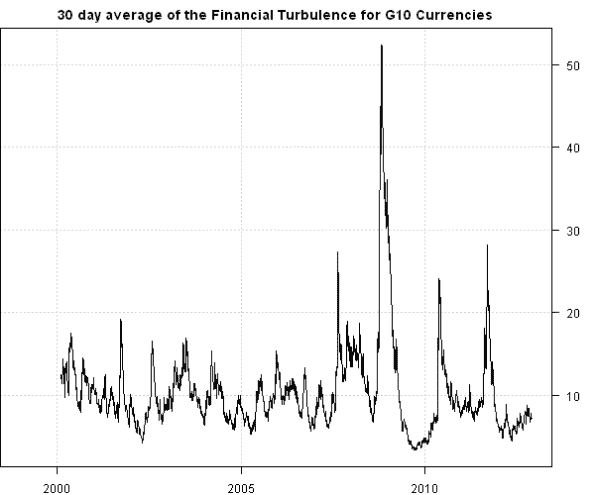

<!--yml
category: 未分类
date: 2024-05-18 14:35:39
-->

# Financial Turbulence Example | Systematic Investor

> 来源：[https://systematicinvestor.wordpress.com/2012/12/01/financial-turbulence-example/#0001-01-01](https://systematicinvestor.wordpress.com/2012/12/01/financial-turbulence-example/#0001-01-01)

Today, I want to highlight the Financial Turbulence Index idea introduced by Mark Kritzman and Yuanzhen Li in the [Skulls, Financial Turbulence, and Risk Management](http://www.cfapubs.org/doi/abs/10.2469/faj.v66.n5.3) paper. [Timely Portfolio](http://timelyportfolio.blogspot.ca) did a great series of posts about Financial Turbulence: [Part 1](http://timelyportfolio.blogspot.ca/2011/04/great-faj-article-on-statistical.html), [Part 2](http://timelyportfolio.blogspot.ca/2011/04/great-faj-article-on-statistical_26.html), [Part 3](http://timelyportfolio.blogspot.ca/2011/04/great-faj-article-on-statistical_6197.html).

As example, I will compute Financial Turbulence for the equal weight index of [G10 Currencies](http://www.invescopowershares.com/products/overview.aspx?ticker=DBV). First, I created a helper function [get.G10() function in data.r at github](https://github.com/systematicinvestor/SIT/blob/master/R/data.r) to download historical data for G10 Currencies from [FRED](http://research.stlouisfed.org/fred2/).

```

get.G10 <- function() {
	# FRED acronyms for daily FX rates
map = '
FX          FX.NAME        
DEXUSAL     U.S./Australia 
DEXUSUK     U.S./U.K.      
DEXCAUS     Canada/U.S.    
DEXNOUS     Norway/U.S.    
DEXUSEU     U.S./Euro      
DEXJPUS     Japan/U.S.     
DEXUSNZ     U.S./NewZealand
DEXSDUS     Sweden/U.S.    
DEXSZUS     Switzerland/U.S.
'

	map = matrix(scan(text = map, what='', quiet=T), nc=2, byrow=T)
		colnames(map) = map[1,]
		map = data.frame(map[-1,], stringsAsFactors=F)

	# convert all quotes to be vs U.S.
	convert.index = grep('DEXUS',map$FX, value=T)	

	#*****************************************************************
	# Load historical data
	#****************************************************************** 
	load.packages('quantmod')

	# load fx from fred
	data.fx <- new.env()
	getSymbols(map$FX, src = 'FRED', from = '1970-01-01', env = data.fx, auto.assign = T)		
		for(i in convert.index) data.fx[[i]] = 1 / data.fx[[i]]

	# extract fx where all currencies are available
	bt.prep(data.fx, align='remove.na')
	fx = bt.apply(data.fx, '[')

	return(fx)
}

```

Next, let’s compute Financial Turbulence Index for G10 Currencies.

```

###############################################################################
# Load Systematic Investor Toolbox (SIT)
# https://systematicinvestor.wordpress.com/systematic-investor-toolbox/
###############################################################################
setInternet2(TRUE)
con = gzcon(url('http://www.systematicportfolio.com/sit.gz', 'rb'))
    source(con)
close(con)

	#*****************************************************************
	# Load historical data
	#****************************************************************** 
	load.packages('quantmod')	

	fx = get.G10()
		nperiods = nrow(fx)

	#*****************************************************************
	# Rolling estimate of the Financial Turbulence for G10 Currencies
	#****************************************************************** 
	turbulence = fx[,1] * NA
	ret = coredata(fx / mlag(fx) - 1)

	look.back = 252

	for( i in (look.back+1) : nperiods ) {
		temp = ret[(i - look.back + 1):(i-1), ]

		# measures turbulence for the current observation
		turbulence[i] = mahalanobis(ret[i,], colMeans(temp), cov(temp))

		if( i %% 200 == 0) cat(i, 'out of', nperiods, '\n')
	}	

	#*****************************************************************
	# Plot 30 day average of the Financial Turbulence for G10 Currencies
	#****************************************************************** 	
	plota(EMA( turbulence, 30), type='l', 
		main='30 day average of the Financial Turbulence for G10 Currencies')

```

[](https://systematicinvestor.wordpress.com/2012/12/01/financial-turbulence-example/plot1-5/)

There is a big spike in the index during 2008-2009 period. If you had monitored the Financial Turbulence Index and reduced or hedged your positions during these times, you would be able to reduce your draw-downs and sleep better at night.

To view the complete source code for this example, please have a look at the [bt.financial.turbulence.test() function in bt.test.r at github](https://github.com/systematicinvestor/SIT/blob/master/R/bt.test.r).