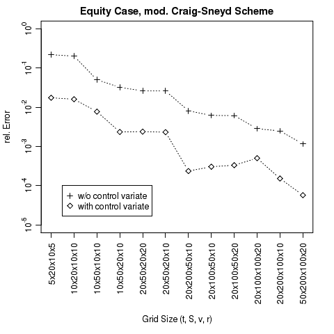

<!--yml
category: 未分类
date: 2024-05-17 23:39:21
-->

# Finite Difference Schemes for the Heston-Hull-White Model – HPC-QuantLib

> 来源：[https://hpcquantlib.wordpress.com/2011/09/11/finite-difference-schemes-for-the-heston-hull-white-model/#0001-01-01](https://hpcquantlib.wordpress.com/2011/09/11/finite-difference-schemes-for-the-heston-hull-white-model/#0001-01-01)

The hybrid Heston-Hull-White model is tailor-made to analyse the impact of stochastic interest rates on structured equity notes like e.g. auto-callables.

Unfortunately a semi-closed solution for european options exists only if at least two correlations are equal to zero which is in general unrealistic. A set of semi-closed approximations for this model can be found [here](http://mpra.ub.uni-muenchen.de/24174/1/MPRA_paper_24174.pdf) [1]. The [QuantLib](http://www.quantlib.org) has a finite difference pricing engine for american, bermudan and european options for the Heston-Hull-White model. This pricing engine supports cash dividends, control variate via the semi-closed Heston Model and pricing different strikes of european options of the same maturity using one backward solver run (especially useful to gain a large speed-up during model calibration.).

The Heston-Hull-White model is a good testbed to test the efficiency of the finite difference schemes based on operator splitting which are implemented in the [QuantLib](http://www.quantlib.org) :

*   Douglas
*   Craig-Sneyd
*   Modified Craig-Sneyd
*   Hundsdorfer-Verwer
*   Modified Hundsdorfer-Verwer

These operator splitting methods are described [here](http://www.math.ualberta.ca/ijnam/Volume-7-2010/No-2-10/2010-02-06.pdf) [2]. The testbed contains ten parameter sets of the Heston-Model taken from different publications.

![\begin{array}{|c|c|c|c|c|c|c|c|c|} \hline {\rm Model} & v_0 & \kappa_v & \theta_v & \sigma_v & \rho_{Sv} & r & q & \mbox{Ref} \\ \hline \hline {\rm't\ Hout\ Case\ 1}& 0.04& 1.5& 0.04& 0.3& -0.9& 0.025& 0.0 &[2]\\ {\rm't\ Hout\ Case\ 2} & 0.12& 3.0& 0.12& 0.04& 0.6& 0.01& 0.04 &[2]\\ {\rm't\ Hout\ Case\ 3}& 0.0707&0.6067& 0.0707& 0.2928& -0.7571& 0.03& 0.0 & [2]\\ {\rm't\ Hout\ Case\ 4}& 0.06& 2.5& 0.06& 0.5& -0.1& 0.0507& 0.0469 &[2]\\ {\rm Ikonen\ Toivanen}& 0.0625& 5& 0.16& 0.9& 0.1& 0.1& 0.0 &[3]\\ {\rm Kahl\ J\ddot{a}ckel}& 0.16& 1.0& 0.16& 2.0& -0.8& 0.0& 0.0 &[4]\\ {\rm Equity Case }& 0.07& 2.0& 0.04& 0.55& -0.8& 0.03& 0.035 &\\ {\rm High Correlation}& 0.07& 1.0& 0.04& 0.55& 0.9& 0.02& 0.04& \\ {\rm small\ \sigma_v}& 0.07& 1.0& 0.04& 0.001& -0.75& 0.04& 0.03& \\ \kappa_v=\sigma_v\rho_{Sv}& 0.07& 0.4& 0.04& 0.5& 0.8& 0.03& 0.03 &\\ \hline \end{array}](img/8a1d96b49959d026fd532132c20528a2.png)

The Hull-White parameters are set to  and .  The equity interest rate correlation is , interest rates and stochastic volatility aren’t correlated  The benchmark call options have maturity of 5 years, underlying at time  is  and possible strikes are

.

The benchmark value is the average relative difference between the reference values and the option prices on the lattice for the different  strikes and  models.

The diagram below shows the results of the “Equity Case” for different grid sizes . and with control variate based on the semi–closed Heston Model. Clearly the Douglas scheme is the worst performer, the (modified) Craig-Sneyd and modified Hundsdorfer-Verwer scheme are the winner.

The overall average over the ten models is dominated by the two “pathological” parameter sets  “Ikonen-Toivanen” and “Kahl-Jäckel”. Again the Douglas scheme can not compete with the other schemes. The differences between the other schemes are comparable small except for the largest grid where the modified Hundsdorfer-Verwer scheme performs badly.

The relative pricing error with and without control variate is shown in the diagram below for the “Equity Case” Heston model and the modified Craig-Sneyd scheme. On average the usage of the control variate reduces the relative pricing error by a factor of 15.

The source code is available [here](http://hpc-quantlib.de/src/fdmscheme.zip). It depends on [QuantLib 1.1](http://quantlib.org/download.shtml) or higher.If you want to generate the plots you’ll also need [R.](http://www.r-project.org/)

[1] L. A. Grzelak, C. W. Oosterleea, Lech A., [On the Heston Model with Stochastic Interest Rates.](http://mpra.ub.uni-muenchen.de/24174/1/MPRA_paper_24174.pdf)

[2] K.J. in ‘t Hout, S. Foulon, [ADI finite difference schemes for option pricing in the Heston model with correlation.](http://www.math.ualberta.ca/ijnam/Volume-7-2010/No-2-10/2010-02-06.pdf) Int. J. Numer. Anal. Mod. **7**, 303-320 (2010).

[3]  S. Ikonen, J. Toivanen, [Operator Splitting Methods for American Options with Stochastic Volatility.](http://users.jyu.fi/~tene/papers/Ikonen.pdf)

[4] C. Kahl, P. Jäckel [Not-so-complex logarithms in the Heston model.](http://www2.math.uni-wuppertal.de/~kahl/publications/NotSoComplexLogarithmsInTheHestonModel.pdf)