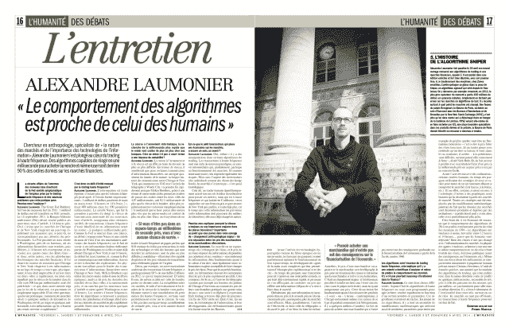

<!--yml
category: 未分类
date: 2024-05-18 14:22:00
-->

# Flash Boy @ the old Bourse de Paris – Sniper In Mahwah & friends

> 来源：[https://sniperinmahwah.wordpress.com/2014/04/05/flash-boy-the-old-bourse-de-paris/#0001-01-01](https://sniperinmahwah.wordpress.com/2014/04/05/flash-boy-the-old-bourse-de-paris/#0001-01-01)

No, I dit not read Michael Lewis’ “Flash Boys” yet, and I have zero ego as a writer (I am only interested in researching), but I am quite happy to see that my (non polemical) book already has (and will have a lot of) reviews in large range of newspapers – very different politically speaking.

Here is an interview I gave to *L’Humanité* and published yesterday – *L’Humanité* was the first to review the first part of my book last year. The photo was taken in front of the Bourse de Paris (not the new one in Basildon, UK, but the old Palais Brongniart in the centre of Paris – a empty shell now…  