<!--yml
category: 未分类
date: 2024-05-17 23:38:39
-->

# Fokker-Planck Equation, Feller Constraint and Boundary Conditions – HPC-QuantLib

> 来源：[https://hpcquantlib.wordpress.com/2013/05/04/fokker-planck-equation-feller-constraint-and-boundary-conditions/#0001-01-01](https://hpcquantlib.wordpress.com/2013/05/04/fokker-planck-equation-feller-constraint-and-boundary-conditions/#0001-01-01)

The Fokker-Planck forward equation is an important tool to calibrate local volatility extensions of stochastic volatility models, e.g. the local vol extension of the Heston model. But the treatment of the boundary conditions – especially at zero instantaneous variance – is notoriously difficult if the Feller constraint

of the square root process for the variance 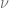

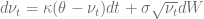

is violated. The corresponding Fokker-Planck forward equation

 *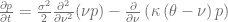

describes the time evolution of the probability density function *p* and the boundary at the origin  is instantaneously attainable if the Feller constraint is violated. In this case the stationary solution [1] of the Fokker-Planck equation

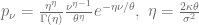

diverges with

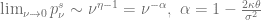

and the zero flow boundary condition at the origin

![\left.\left[ \frac{\sigma^2}{2}\frac{\partial}{\partial \nu} (\nu p) + \kappa(\nu-\theta)p\right]\right|_{\nu=0} = 0 ](img/0a363d806048f3f15d07d14e9f90bfd1.png)

becomes hard to track numerically. Rewriting the partial differential equation in terms of 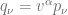 helps to mitigate the problem [2].

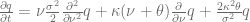

The corresponding zero flow boundary condition in *q* reads as follows

![\left.\left[ \nu\frac{\sigma^2}{2}\frac{\partial}{\partial \nu} q + \kappa\nu q\right]\right|_{\nu=0} = 0 ](img/1d9af5d4fcf08f5782f5c8f3da45a731.png)

The first step in order to apply the boundary condition is to discretize the transformed Fokker-Planck equation in space direction on a non-uniform grid 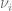

![\frac{\partial q_i}{\partial t} = \alpha_iq_{i-1}+\beta_iq_i+\gamma_iq_{i+1]} ](img/052394286b32b6291c58862678e83ba2.png)

with

Next step is to discretize the zero flow boundary condition using a second order forward discretization [3] for the derivative 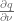.

![\left.\left[ \nu\frac{\sigma^2}{2}\frac{\partial}{\partial \nu} q + \kappa\nu q\right]\right|_{\nu=\nu_{i-1}} \approx a_iq_{i-1} + b_iq_{i} + c_iq_{i+1} = 0 ](img/01399fbc2ae0d6d714bf008fc437b389.png)

with

Now the value  at the boundary  can be expressed in terms of 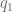 and 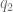.

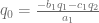

This equation can be used to remove the boundary value  from the discretization of the transformed Fokker-Planck equation. In the same manner the zero flow boundary condition can be implemented for the upper boundary 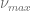 and for the original Fokker-Planck equation.

The following parameters of the square-root process will be used to test the different boundary conditions.

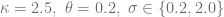

The uniform grid 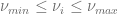 has 100 or 1000 grid points and the stationary solution 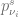 of the Fokker-Planck equation is chosen as the start configuration on the grid points. The boundaries 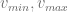 are defined via the inverse cumulated distribution function such that

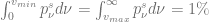.

The grid covers 98% of the distribution and this value would not change over time if the boundary conditions are satisfied without discretiszation errors. To test the magnitude of the discretization errors we let the initial solution evolve over one year using 100 time steps with the Crank-Nicolson scheme. The resulting solution 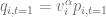 is interpolated using cubic splines to get the function 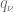. The value

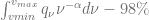

servers as a quality indicator for the discretization errors of the boundary condition.

As can be seen in the diagram below if  is small then the original Fokker-Planck equation shows smaller discretization errors than the transformed Fokker-Planck equation in 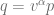. But if  becomes larger and especially if the Feller constraint is violated then the solution of the transformed Fokker-Planck equation clearly outperforms the original solution. As a rule of thumb based on this example one should use the original Fokker-Planck equation if 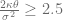  and the transformed equation otherwise.

[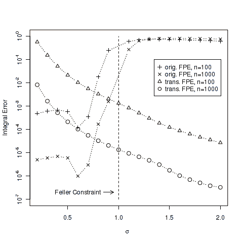](https://hpcquantlib.wordpress.com/wp-content/uploads/2013/05/plot.png)

The same techniques can be used to solve the Fokker-Planck equation for the Heston model. The code for the numerical tests is available in the latest [QuantLib](http://www.quantlib.org) version from the SVN [trunk](http://sourceforge.net/p/quantlib/code/HEAD/tree/). The diagram is based on the test FDHestonTest::testSquareRootEvolveWithStationaryDensity.

[1] A. Dragulescu, V. Yakovenko, [Probability distribution of returns in the Heston model with stochastic volatility](http://arxiv.org/pdf/cond-mat/0203046)

[2] V. Lucic, [Boundary Conditions for Computing Densities in Hybrid Models via PDE Methods](http://papers.ssrn.com/sol3/papers.cfm?abstract_id=1191962)

[3] P. Lermusiaux, [Numerical Fluid Mechanics](http://ocw.mit.edu/courses/mechanical-engineering/2-29-numerical-fluid-mechanics-fall-2011/index.htm), Lecture Note 14, Page 5*