<!--yml
category: 未分类
date: 2024-05-17 23:32:07
-->

# Fokker-Planck Forward Equation for the Heston Model – HPC-QuantLib

> 来源：[https://hpcquantlib.wordpress.com/2013/02/10/fokker-planck-forward-equation-for-the-heston-model/#0001-01-01](https://hpcquantlib.wordpress.com/2013/02/10/fokker-planck-forward-equation-for-the-heston-model/#0001-01-01)

Consider the stochastic differential equation of the Heston model for the dynamics of the log-spot 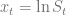

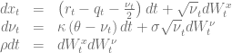

The Fokker-Planck partial differential forward equation describes the time evolution of the probability density function 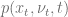

with the initial condition

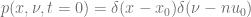

where 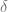 denotes the Dirac delta distribution. A semi-closed form solution for this problem is presented in [1]. When solving the Fokker-Planck forward equation special care must be taken with respect to the boundary conditions, especially if the Feller constraint

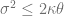

is violated. In this case the boundary at the origin  is instantaneously attainable. A generalisation of Feller’s zero-flux boundary condition should be applied at the origin [2].

![\left.\left[ \frac{\sigma^2}{2}\frac{\partial}{\partial \nu} (\nu p) + \kappa(\nu-\theta)p + \rho\nu\sigma\frac{\partial p}{\partial x}\right]\right|_{\nu=0} = 0, \ \forall x\in \mathbb{R}^+ ](img/4858e2cc2e2eb5d9e31ece43e33931b2.png)

A three point forward differentiation formula can be used to calculate a second order accurate approximation of the partial derivative 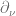 for  [3].

The diagram below shows the solution of the forward equation for the model

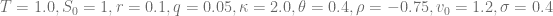

[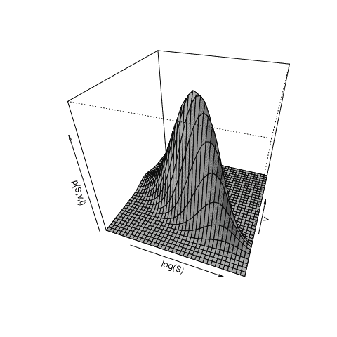](https://hpcquantlib.wordpress.com/wp-content/uploads/2013/02/plot-399.png)

The Feller constraint is violated for 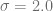 and this changes the shape of the solution completely.

[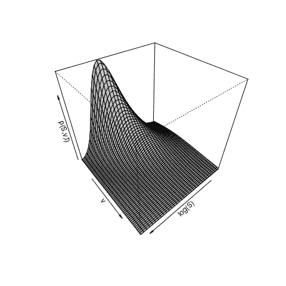](https://hpcquantlib.wordpress.com/wp-content/uploads/2013/02/plot-7992.png)The code for this example is available [here](http://hpc-quantlib.de/src/heston_fpe.zip) and it is based on the latest [QuantLib](http://quantlib.org) version from the SVN [trunk](http://sourceforge.net/p/quantlib/code/HEAD/tree/). It also depends on [RInside](http://dirk.eddelbuettel.com/code/rinside.html) and [Rcpp](http://cran.r-project.org/web/packages/Rcpp/index.html) to generate the plots. In addition the zip contains a short movie clip of the time evolution of the solution for .

[1] A. Dragulescu, V. Yakovenko, [Probability distribution of returns in the Heston model with stochastic volatility](http://arxiv.org/pdf/cond-mat/0203046)

[2] V. Lucic, [Boundary Conditions for Computing Densities in Hybrid Models via PDE Methods](http://papers.ssrn.com/sol3/papers.cfm?abstract_id=1191962)

[3] K. A. Kopecky, [Numerical Differentiation](http://www.karenkopecky.net/Teaching/eco613614/Notes_NumericalDifferentiation.pdf)